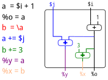

title: Pyrope, a modern HDL with a live flow
class: animation-fade
layout: true

<!-- This slide will serve as the base layout for all your slides -->
.bottom-bar[
  {{title}}
]

---

class: center, middle
background-image: url(https://masc.soe.ucsc.edu/images/masclogo3.png)
background-position: bottom center
background-repeat: no-repeat
background-size: 30%

.center[]

.center[### Haven Skinner, Sheng Hong Wang, Akash Sridhar, Rafael Trapani Possignolo, Kenneth Mayer, Jose Renau]
.center[Computer Engineering]
.center[University of California, Santa Cruz]

---
name: default
background-image: url(https://masc.soe.ucsc.edu/logos/pyrope3.png)
background-position: bottom left
background-repeat: no-repeat
background-size: 10%

layout: true
task: &nbsp;

.task[{{task}}]

---
# Many Hardware Description Languages (HDL)

* Verilog, System Verilog

* Scala-based: Chisel<sup>*</sup>, SpinalHDL<sup>*</sup>

* Python-based: pyMTL, myHDL, pyRTL, migen

* Haskell-based: CλaSH<sup>*</sup>

* PSHDL<sup>*</sup>

* Bluespec

---
# Some problems with current HDLs

* DSL artifacts

* HW constructs

* Not fully synthesizable

* Unable to synthesize objects

* Unable to assimilate existing verilog

---

# HDLs tend to have DSL artifacts

```scala
// Chisel has == for SCALA, === for Chisel
io.v := y === UInt(0)

// pyRTL has special assigments
a <<= 3 // "assign, generated code"
a = 3   // "assign, in Python"
```

* Force designers to program with two languages at once:

Chisel, CλaSH, myHDL, pyMTL, pyRTL

---

# Many HDLs have strange HW constructs

```dart
a = 3
a = a + 1
assert(a==4); // may fail
```

* In several HDLs, the previous assertion may fail:

Chisel, SpinalHDL, CλaSH, PSHDL

Verilog (non-blocking)

---

# HDLs can be not fully synthesize

```verilog
a = 3
#3 // Not synthesizable
a = 4
```

* Some HDLs are not fully synthesizable which adds complexity:

myHDL, Verilog, System Verilog
---

# HDLs can not synthesize objects well

```scala
// no methods in input/outputs
a = input.get_value
```

* HDLs with synthesizable objects:

none
---

# Unable to Assimuilate Verilog

* Verilog is the current standard
* HDLs black-box Verilog modules
* Not much check across boundaries


* Ideally, a language should translate from Verilog to HDL

---

# Informal poll for lack of adoption of HDLs

--

* Verification does not improve with current HDLs. If any it gets harder.

--

* Steep learning curve for many HDLs (eg: CHISEL)

--

* Slower compilation and simulation

--

* Verilog vs HDL (Most tools handle Verilog not X-HDL)

   * Harder frequency/power/area feedback

   * Need to understand/debug generated verilog

---

# Pyrope, a modern HDL with a live flow

* Verification

   * Hot-Reload support, source maps, powerful assertions...

* Steep learning curve, language artifacts

   * Modern and concise programming language, avoiding hardware specific artifacts

   * Static checks as long as they not produce false positives

   * Synthesis and simulation must be equal and deterministic

* Slow compilation and simulation

   * Live (under 30 secs) simulation, reload, and synthesis feedback goal

* Verilog vs HDL (Most tools handle Verilog not X-HDL)

  * Allows Pyrope 2 Verilog, edit Verilog, Verilog 2 Pyrope, edit Pyrope...

---

# Fast/Live Pyrope

* No includes, uses packages

* No DSL (most HDLs) that generate an executable to create code (not incremental)

* Integrated with LGraph to interact with annotations

* Hot Reload simulation capabilities

* Direct simulator generation to avoid intermediate Verilog pass

---

# Things that Pyrope can not do

* Generic programming language, Pyrope is synthesizable

* No recursion, neither function nor variable instantiation recursion

* Loops/iterators unbound at compile time

* Any IO, syscall... handled with external C++ modules

* rd/wr global variables

* No pointers. HDLs use hierarchy for references

---
task: Quick Dive to Pyrope
class: split-40r

# A Counter with a pipeline stage

.lcolumn[
### Pyrope
```coffeescript
// code/counter.prp file
if $enable {
  @total := @total + 1
}
```
]

--

.rcolumn[
### Verilog
```verilog
module s1 (input  clk,
           input  reset,
           input  enable,
           output [3:0] total);
 reg [3:0] total_flop;
 reg [3:0] total_next;

 assign total = total_flop;

 always_comb begin
   total_next = total;
   if (enable)
     total_next = total + 1'b1;
 end

 always @(posedge clk) begin
   if (reset) begin
     total_flop <= 4'b0;
   end else begin
     total_flop <= total_next;
   end
 end
endmodule
```
]
--
.lbcolumn[
### Pyrope unit test
```coffeescript
// code/counter_test.prp file
b as counter ++ (__stage:true) // pipeline type
b.total as (__bits:4)
b.enable = 0
I(b.total == 0)                // assertion
yield                          // advance clock
I(b.total == 0)
b.enable = 1
I(b.total == 0)
yield                          // advance clock
I(b.total == 1)
```
]

---
task: Quick Dive to Pyrope
class: split-40

# A Counter ~~with a pipeline stage~~

.column[
### Pyrope
```coffeescript
// code/counter.prp file
if $enable {
  @total := @total + 1
}
```

### Pyrope unit test
```coffeescript
// code/counter_test.prp file
*b as counter // ++ (__stage:true) // combination type
b.total as (__bits:4)
b.enable = 0
I(b.total == 0)                // assertion
yield                          // advance clock
I(b.total == 0)
b.enable = 1
*I(b.total == 1)
yield                          // advance clock
*I(b.total == 2)
```
]

.column[
### Verilog
```verilog
module s2 (input  clk,
           input  reset,
           input  enable,
           output [3:0] total);
 reg [3:0] total_flop;
 reg [3:0] total_next;

* assign total = total_next;

 always_comb begin
   total_next = total;
   if (enable)
     total_next = total + 1'b1;
 end

 always @(posedge clk) begin
   if (reset) begin
     total_flop <= 4'b0;
   end else begin
     total_flop <= total_next;
   end
 end
endmodule
```
]

---
class: split-40
task: Quick Dive to Pyrope

# Testbenches

* Pyrope language testbenches are synthesizable
* Complex tests can interface with C++

.column[
### c++
```c++
// mysrc/test2.cpp file
#include "prp_cpp.hpp"

void prp_methodx(const prt_tuple i ,prp_tuple &out) {
  prp_struct f(i.get("f");
  prp_number b(f.get("b"))
  prp_number c(i.get(0));
  p.set("res", i.get(0) + f.get("a") + f.get("b");
  p.set("mor", i.get(0) | f.get("a") | f.get("b");
}
```
```bash
$find . -type f
./code/test1.prp
./mysrc/test2.cpp
$prp --run test1.mytest ./mysrc/test2.cpp
```
]

.column[
### Pyrope
```coffeescript
// code/test1.prp file
mytest = ::{
  puts import io.puts
  puts("Hello World")
  I(1 == 0+1)
  yield
  c = 1
  f.a = 2
  f.b = 3

  m import methodx
  a = m(c, f)
  I(a.res == 6)
  I(a.mor == 0b11)
}
```
]

---
task: Quick Dive to Pyrope

# A Ripple Carry Adder

```coffeescript
// libs/adder/code/rca.prp file
fa = :($a $b $cin %sum %cout):{      // method with explicit arguments
  tmp   = $a  ^ $b
  %sum  = tmp ^ $cin
  %cout = (tmp & $cin) | ($a & $b)
}

carry = $cin                         // 0 if RCA without carry in
for i in (0..a.__bits) {             // iterate #bits
  tmp = fa(a[[i]],b[[i]],carry)      // function call to fa
  %sum[[i]] = tmp.sum
  carry     = tmp.cout
}
%cout = carry

test2 = ::{
  puts import io.puts
  c = rca(a:32, b:4, cin:0)
  puts("sum is {0:b} {0}",c.sum)     // puts has c++ fmt in prplib
}
```

---
task: Quick Dive to Pyrope
# A Compact Ripple Carry Adder

```coffeescript
// libs/adder/code/rca2.prp file
c = $cin
for i in (0..$a.__bits) {
  %sum[[i]] = $a[[i]] ^ $b[[i]] ^ c
  c =  ($a[[i]] & $b[[i]]) | ($a[[i]] & c) | ($b[[i]] & c)
}

test = ::{
  for a in (1..100); b in (0..33); c in (0 1) {
    d = rca2(a:a, b:b, cin:c)
    I(d.sum == (a+b+c))
  }
}
```

```bash
$find . -type f
./libs/adder/code/rca2.prp
$prp --run libs.adder.rca2.test
```

---
task: Quick Dive to Pyrope

# A Carry Lookahead Adder

```coffeescript
// libs/adder/code/cla.prp file
and_red import lib.and_reduction
%sum = rca(a:$a b:$b cin:0).sum

g = $a & $b // Generate
p = $a ^ $b // Propagate

// 4 bit: c = g[[3]] | g[[2]] & p[[3]] | g[[1]] & p[[3]] & p[[2]] |...
c = $cin & and_red(p)
for i in (0..a.__bits) {
  _tmp = g[[i]]
  for j in (i..(a.__bits-1)) {
    _tmp = _tmp & p[[j]]
  }
  c = c | _tmp
}
%cout = c

test = ::{
  for a in (1..40) ; b in (1..100) {
    c1 = cla(a:a,b:b,cin:0)
    c2 = rca(a:a,b:b,cin:0)
    I(c1.cout == c2.cout)
  }
}
```

---
task: Quick Dive to Pyrope

# Specializing the adders

```coffeescript
// libs/adder/code/scla.prp file
cla = :($a $b) when $a.__bits==8:{           // specialize when bits == 8
  s1 = cla($a[[0..3]],$b[[0..3]],cin:0)      // cla for 4 bits
  t = generate($a[[0..3]],$b[[0..3]])        // generate carry method
  s2 = cla($a[[4..7]],$b[[4..7]],cin:t)      // CLA with fast cin
  %sum = (s2.sum,s1.sum)[[]]                 // bit concatenation
}

cla = :($a,$b) when $a.__bits==12:{          // specialize when bits == 12
  s1 = cla($a[[0..7]],$b[[0..7]],cin:0)      // .. Ruby style ranges
  t = generate($a[[0..6]],$b[[0..6]])        // generate carry method
  s2 = cla($a[[6..11]] $b[[6..11]],cin:t)
  %sum = (s2.sum,s1.sum)[[]]
}

cla = :($a $b):{                             // default CLA (not CLA, just RCA)
  return rca($a,$b,cin:0)
}

test = ::{
  s = cla(3,5)
  I(s.sum == 8)
}
```

```bash
$prp --run libs.adder.scla.test
```

---
task: Quick Dive to Pyrope

# Customizing the counter

```coffeescript
// code/ccounter.prp file
..+.. import libs.adder.scla.cla  // Overload + operator
if $enable {
  @total := @total + 1
  I(3 ..+.. 4 == 7 == 3 + 4)      // + is an alias for ..+..
}

my_add import libs.adder.scal.cla
..+.. = :($a,$b) when $a.__bits>1 and $b.bits==1:{
 // Special code for special case
}

```

.footnote[
  created with [remark](https://github.com/gnab/remark)
]

---
task: Quick Dive to Pyrope

# 3 Pipeline stage adder

```coffeescript
// code/add4.prp file
..+.. import libs.adder.scla.cla
s1 import libs.adder.rca

%sum.__stage = true
%sum1.__stage as true
%sum2 as (__stage:true)

sum1 = $a + $b
sum2 = $c + $c
%sum = s1(a:sum1.sum,b:sum2.sum,cin:0)

test = ::{
  b as add4(a:1,b:2,c:3,d:4)
  I(b.sum1 == 10 and b.sum2 ==  0 and b.sum ==  0)
  yield
  I(b.sum1 == 10 and b.sum2 == 10 and b.sum ==  0)
  yield
  I(b.sum1 == 10 and b.sum2 == 10 and b.sum == 10)
}
```

---
class: center, middle
background-image: url(https://masc.soe.ucsc.edu/logos/pyrope3_large.png)
background-position: bottom center
background-repeat: no-repeat
background-size: 20%

# Pyrope vs ...

---
class: split-40

# vs Verilog

.column[
### Verilog
```verilog
module vsverilog (input clk,
                  input reset,
                  input  [2:0] a,
                  input  [2:0] b,
                  output reg [3:0] c);

 always @(posedge clk) begin
   if (reset) begin
     c <= 3'b0;
   end else begin
     c <= a + b;
   end
 end

endmodule
```
]

.column[
### Pyrope
```coffeescript
// code/vsverilog.prp file
($a,$b) as __bits:3
%c = $a + $b
```
* No inputs/outputs
* Infer bit sizes
* Automatic reset to zero
* No reg/wire
* No blocking/non-blocking
]

---
class: split-40

# vs Chisel

.column[
### Chisel
```scala
import Chisel._
class GCD extends Module {
  val io = new Bundle {
    val a  = UInt(INPUT,  16)
    val b  = UInt(INPUT,  16)
    val e  = Bool(INPUT)
    val z  = UInt(OUTPUT, 16)
    val v  = Bool(OUTPUT)
  }
  val x  = Reg(UInt())
  val y  = Reg(UInt())
  when   (x > y) { x := x - y }
  unless (x > y) { y := y - x }
  when (io.e) { x := io.a; y := io.b }
  io.z := x
  io.v := y === UInt(0)
}
object Example {
  def main(args: Array[String]): Unit = {
    chiselMain(args, () => Module(new GCD()))
  }
}
```
]

.column[
### Pyrope
```coffeescript
if $a? and $b? {
  (@x @y) = ($a $b)
}else{
  if   @x > @y { @x = @x - @y }
  else         { @y = @y - @x }
  if @y == 0   { %z = @x      }
}
```
```coffeescript
test = ::{
  puts import io.puts
  gcd as vschisel
  (a,b,z) as __bits:16
  z = gcd(a:a.__rnd,b:b.__rnd)
  waitfor z
  puts("gcd for {} and {} is {}", a, b, z)
}
```
* Global type inference
* No scala vs chisel syntax
]

---
class: split-40

# vs Bluespec

.column[
### BSV
```coffeescript
module mkTb (Empty);
  Reg#(int) cycle <- mkReg (0);

  rule count_cycles;
    cycle <= cycle + 1
    if (cycle > 7) $finish(0);
  endrule

  int x = 10;
  rule r;
    int a = x;
    a = a * a;
    a = a - 5;
    if (pack(cycle)[0] == 0) a = a + 1;
    else                     a = a + 2;

    if (pack(cycle)[1:0] == 3) a = a + 3;

    for (int k=20;k<24;k=k+1)
      a = a + k;
    $display ("%0d: rule r, a=%0d", cycle, a);
  endrule
endmodule: mkTb
```
]

.column[
### Pyrope
```coffeescript
// code/vsbsv.prp file
@cycles = @cycles + 1
x = 10
a = x
a = a * a
a = a - 5
if cycle[[0]] == 0 { a = a + 1 }
else               { a = a + 2 }

if cycle[[0..1]] == 3 { a = a + 3 }

for k in (20..24) {
  a = a + k
}
puts import io.puts
puts("{}: rule, a={}",cycle,a)
```
* More compact syntax
* More traditional language, no rules
]

---
class: split-40

# vs migen (Python HDL)

.column[
### migen
```python
from migen.fhdl.std import *
from migen.fhdl import verilog
class Blinker(Module):
  def __init__(self, led, maxperiod):
    counter = Signal(max=maxperiod+1)
    period = Signal(max=maxperiod+1)
    self.comb += period.eq(maxperiod)
    self.sync += If(counter == 0,
        led.eq(˜led),
        counter.eq(period)
      ).Else(
        counter.eq(counter - 1)
      )
led = Signal()
my_blinker = Blinker(led, 3000000)
print(verilog.convert(my_blinker, ios={led}))
```
]

.column[
### Pyrope
```coffeescript
// code/vsmigen.prp file
if @counter {
  @counter -= 1 // @counter-- does not work
}else{
  @counter = $maxperiod
  @led = ~@led // Not %, @ is always valid
}

test = ::{
  puts import io.puts
  b = vsmigen(maxperiod:300000)
  puts("led is {}",b.led)
  yield 300000
  puts("led is {}",b.led)
}
```
* Avoid weird DSL syntax
]

---
class: split-40

# vs pyRTL (Python HDL)

.column[
### pyRTL
```python
def fibonacci(n, req, bitwidth):
    a = pyrtl.Register(bitwidth, 'a')
    b = pyrtl.Register(bitwidth, 'b')
    i = pyrtl.Register(bitwidth, 'i')
    local_n = pyrtl.Register(bitwidth, 'local_n')
    done = pyrtl.WireVector(bitwidth=1, name='done')

    with pyrtl.conditional_assignment:
        with req:
            local_n.next |= n
            i.next |= 0
            a.next |= 0
            b.next |= 1
        with pyrtl.otherwise:
            i.next |= i + 1
            a.next |= b
            b.next |= a + b
    done <<= i == local_n
    return a, done
```
]

.column[
### Pyrope
```coffeescript
// code/vspyrtl.prp file
if $n? {  // new request
  (@a,@b,@i) = (0,0,n)
}else{
  (@a,@b,@i) = (@b,@a+@b, @i-1)
}
if @i == 0 { %result = @a }
```
```coffeescript
test = ::{
  seq = (0 1 1 2 3 5 8 13 21 34)
  for n in (0..9) {
    n as __bits:6     // 6 bit fibonacci
    b = vspyrtl(n:n)
    waitfor b.result  // multiple clocks
    I(b.result == seq[n])
  }
}
```
* same issues as chisel
]

---
class: split-40

# vs PSHDL

.column[
### PSHDL
```dart
module de.tuhh.ict.Timing {
    out uint a=1,b=2,c=3,d=4;
    a=b;
    b=c;
    c=d;
    d=5;
    // a == b == c == d == 5
}

module de.tuhh.ict.Timing {
    out register uint a=1,b=2,c=3,d=4;
    a=b;
    b=c;
    c=d;
    d=5;
    // a==2, b==3, c==4, d==5
}
```
]

.column[
### Pyrope
```coffeescript
// code/vspshdl.prp file
// % is the output vector
% = (a:1,b:2,c:3,d:4)
%a = %b
%b = %c
%c = %d
%d = 5
I(% == (a:2,b:3,c:4,d:5))
```
* Avoid hardware driven syntax
]

---
class: split-40

# vs CλaSH

.column[
### CλaSH
```haskell
upCounter :: Signal Bool -> Signal (Unsigned 8)
upCounter enable = s
  where
    s = register 0 (mux enable (s + 1) s)
```
]

.column[
### Pyrope
```coffeescript
// code/vsclash.prp file
@upCounter as __bits:8
if $enable {
 @upCounter += 1
}
```
* Easier to guess hw mapping
* More familiar syntax
]


---
class: split-40

# vs Liberty (LXE)

.column[
### Liberty
```dart
using corelib;
instance gen:source;
instance hole:sink;
gen.create_data = <<<
 *data = LSE_time_get_cycle(LSE_time_now);
 return LSE_signal_something | LSE_signal_enabled;
>>>;
gen.out ->[int] hole.in;
collector out.resolved on "gen" {
  header = <<<
#include <stdio.h>
    >>>;
  record = <<<
    if (LSE_signal_data_known(status) &&
        !LSE_signal_data_known(prevstatus)) {
      if(LSE_signal_data_present(status)) {
        printf(": %d\n", *datap);
      } else {
        printf(": No data\n");
      }
    }
  >>>;
};
```
]

.column[
### Pyrope
```coffeescript
// code/vsliberty.prp file
puts import io.puts
gen  = ::{
  @data = @data + 1
}
sink = ::{
  if $data? {
     puts(": {}",,,,$data)
  }else{
     puts(": No data")
  }
}
s = sink __stage:true
g = gen  __stage:true
s.data = g.data
```
* Clean syntax
* No extra verbosity
* Similar handshake idea
]


---
class: split-40

# vs Dart

.column[
### dart
```dart
class Person {
  Person.fromJson(Map data) {
    print('in Person');
  }
}

class Employee extends Person {
  Employee.fromJson(Map data)
   : super.fromJson(data) {
    print('in Employee');
  }
}

main() {
  var emp = new Employee.fromJson({});
}
// Cascade operations
a..field1 = 1
 ..field2 = 2
```
]

.column[
### Pyrope
```coffeescript
// code/vsdart.prp file
puts import io.puts
person.fromJson = ::{
  puts("in Person")
}

employee = person
employee.fromJson = ::{
  super($) // Notice, no fromJson
  puts("in Employee")
}

emp = employee.fromJson
// No cascade operations
a.field1 = 1
a.field2 = 2
```
* Prototype inheritance
* No memory (new/delete)
]

---
class: split-40

# vs Reason

.column[
### Reason
```dart
type animal = Dog | Cat | Bird;
let result = switch (isBig, animal) {
| (true, Dog) => 1
| (true, Cat) => 2
| (true, Bird) => 3
| (false, Dog | Cat) => 4
| (false, Bird) => 5
};
```
]

.column[
### Pyrope
```coffeescript
// code/vsreason1.prp file
unique if isBig and animal.__obj == Dog {
  result = 1
}elif isBig and animal.__obj == Car {
  result = 2
}elif isBig and animal.__obj == Bird {
  result = 3
}elif !isBig and (animal.__obj == Bird 
                or animal.__obj == Cat) {
  result = 4
}elif !isBig and animal.__obj == Bird {
  result = 5
}
```
* Pyrope mimics SystemVerilog unique keyword, no case or switch
]
---
class: split-40

# vs Reason

.column[
### Reason
```dart
let increment x => x + 1;
let double    x => x + x;

let eleven = increment (double 5);

let add = fun x y => x + y;
let addFive = add 5;
let eleven = addFive 6;
let twelve = addFive 7;
```
]

.column[
### Pyrope
```coffeescript
// code/vsreason.prp file
increment = :($x):{$x + 1 }
double    = :($x):{$x + $x}

eleven = 5 |> double |> increment

add = :($x,$y):{$x + $y}
addFive = \add  // add reference, no call
addFive = ::{ super(x:5,y:$y) }
eleven  = ::{ super(y:6) }
twelve  = ::{ super(y:7) }
```
* Pyrope has primitive currying
]

---
class: split-50

# vs Python

.column[
### Python
```python
class objectTest():
    def __init__(self,a):
      self.value = a
    def get_value(self):
      return self.value


a = objectTest(1)
b = objectTest(1)

assert a             != b
assert a.get_value() != b.get_value
assert a.get_value() == b.get_value()
assert a.get_value   != b.get_value

total = [x*x for x in range(10) if x % 2]
```
]

.column[
### Pyrope
```coffeescript
// code/vspython.prp file
objectTest.get_value = ::{
  return @this.myvalue
}
objectTest.set_value = :($a):{
  @this.myvalue = $a
  return this
}

a = objecttest.set_value(1)
b = objecttest.set_value(1)

I(a == b == 1)
I(a.get_value() == b.get_value)
I(a.get_value() == b.get_value())
I(a.get_value   == b.get_value)
I(a.__obj == b.__obj and a.__obj != 1.__obj)

total = (0..10) |> filter ::{$ & 1} |> map ::{$*$}
I(total == (1,9,25,49,81))
```
]

---
class: split-40

# vs Javascript

.column[
### Javascript Tricky
```dart
const a = {
  num: 0,
  valueOf: function() {
    return this.num += 1
  }
};
const equality = (a==1 && a==2 && a==3);
console.log(equality); // true

for(let pair of myMap) {
  var [key, value] = pair;
  console.log(key + " = " + value);
}
```
]

.column[
### Pyrope
```coffeescript
// code/vsjs1.prp file
puts import io.puts
a = 0
a.__read = ::{
  this += 1
}
eq = (a == 1) and (a == 2) and (a == 3)
I(eq)

for a in myMap {
  puts("{} = {}",,,,a.__index,,,a,,,)
}
```
* Some similarities in functionality
]
---
class: split-50

# vs MATLAB


.column[
### MATLAB
```matlab
x = 1:10
y = 10:-2:0
A = [1 2; 3 4]  # matrix 2x2

sum = 0;
for i=2:length(x)
   sum = sum + abs(x(i));
end

x3=(1:3).*2;
A = [1 0 3];
B = [2 3 7];
C = A.*B
% C = 2 0 21
C = A * B
% C = [[2 0 6] [3 0 9] [7 0 21]]
```
]

.column[
### Pyrope
```coffeescript
x = (1..10)
y = (10..0) ..by.. 2 // (10 8 6 4 2 0)
A = ((1,2),(3,4))

sum = 0
for i in (1..x.__length) {
  sum = sum + abs(x(i))
}

x3=(1..3) ** 2  // compile error
I((2,4,6) == (1..3) * 2)
A = (1,0,3)
B = (2,3,7)
C = A ** B      // OK, matching sizes
I(C == (2,0,21))
D = A * B
I(C == ((2,0,6),(3,0,9),(7,0,21)))
```
* Share tuple vs element operators
* Different applications/goals/...
]


---
class: split-50

# vs Coffeescript

.column[
### Coffeescript
```coffeescript
square = (x) -> x * x
eat    = (x) -> alert square x

eat x for x in [1, 2, 3] when x isnt 2

r361 = square 3 + square 4
r25  = square(3) + square 4
// r361 == 361 and r25 == 25

// Minimum number of parenthesis
y = pow 10, floor log10 x
// Equivalent to
y = pow(10, floor(log10(x)))

```
]

.column[
### Pyrope
```coffeescript
puts import io.puts
square = :($x):{$ * $}
eat    = :($x):{puts(square($)) }

for food in (1 2 3) {
  if food !=2 { eat food }
}

r=square(3 + square(4))// 361
r=square(3) + square(4)// 25

// Minimum number of parenthesis
y = pow(10 floor(log10(x)))
// Simpler syntax with pipes
y = log2 x |> floor |> pow 10
```
* No iterators after statement
* Different rules about arguments
]

---
class: center, middle
background-image: url(https://masc.soe.ucsc.edu/logos/pyrope3_large.png)
background-position: bottom center
background-repeat: no-repeat
background-size: 20%

# Pyrope Syntax

---
class: split-50
# Basic Control Flow

.column[
### ifs
```coffeescript
// code/controlflow1.prp

if cond1 {
  I(cond1)
}elif cond2 {
  I(!cond1 and cond2)
}

unique if cond3 {
  I( cond3 and !cond4)
}elif cond4 {
  I(!cond3 and  cond4)
}else{
  I(!cond3 and !cond4)
}

unique if cond5 {
  I( cond5 and !cond6)
}elif cond6 {
  I(!cond5 and  cond6)
}
I(cond5 and cond6) // Unique implies full too
```
]

.column[
### iterators
```coffeescript
// code/controlflow2.prp
total = 0
for a in (1..3) { total += a }
I(total == (1+2+3))

total = 0 // compact double nested loop
for a in (1..3) ; b in (1, 2) { total += a }
I(total == (1+2+3 + 1+2+3))

// Powerful library. Simple reduce example
reduce = ::{
  t = $0
  for a in $[1..] {
    t = $.__block(t, a)
  }
  return t
}

a = (1, 2, 3) |> reduce ::{$0+$1}
I(a == (1+2+3))
```
]

---
class: split-50
# Element vs Tuple operator

.column[
### Basic ops
```coffeescript
// code/elementvstuple1.prp
// operators read left and right side

a = (1, 2, 3) + 4      // element op
I(a == (5, 6, 7))

a = (1, 2, 3) ++ (4, 5) // tuple concat
I(a == (1, 2, 3, 4, 5))

a = (1, 2, 3) ..+.. 4  // element op
I(a == (5, 6, 7))

// ..XX.. means operator XX
// .. are optional for non-alphanumeric operators
```
]

.column[
### custom operators
```coffeescript
// code/elementvstuple2.prp
..dox.. = :($a,$b):{  // .. is optional
  t = ()
  for a in $0 ; b in $1 {
    t ++= a+b
  }

  return t
}
I((1, 3) ..dox.. (2, 1) == (3, 2, 5, 4))

sub1 = ::{
  t = ()
  b = $1[0]   // first element in rhs
  for a in $0 {t ++= a+b}
  return t
}
// .. required in call to be operator
I((3, 2) ..sub1.. 1 == (2, 1))
I((3, 2) ..sub1.. (2, 3) == (1, 0))
```
]

---
class: split-50
# Operator precedence

* Unary operators (!,~,@,?,%...) bind stronger than binary operators (+,++,-,*...)
* **Only** six levels of operator precedence (16 levels in c++)
* Always left-to-right evaluation

.column[
.small[
| Priority | Category | Main operators in category |
|:-----------:|:-----------:|-------------:|
| 1          | Unary     | not ! ~ @ ? % $ |
| 2          | Mult/Div  | *, /         |
| 3          | bitwise ops | ^, & |     |
| 4          | other bin | +, ++, --, <<, >>, >>>, <<< |
| 5          | comparators |    <, <=, ==, !=, >=, > |
| 6          | logical     | and, or    |
]
]

.column[
```coffeescript
// code/precedence1.prp
// Typically expected results
I((true or !false) == (true or (!false)))
I((3*5+5) == ((3*5) + 5))

a = true or false==false
b = true or (false==false)
I(a == b)

c = (2) |> fcall(1)
I(c == fcall(1,2))

//bar = true or false and true // compile error
//x = 3 ++ 4 -- 3              // compile error

c = a == 3 == b                // OK
I(c == (a==3 and 3==b))
```
]

---
class: split-50
# Operator precedence

.column[
### explicit newline
```coffeescript
// code/precedence2.prp
bar = x == 3
   or x == 3 and !(x!=3)
   or false

//bar = false or
//      true     // compile error, ops after newline

I((true or false==false) == (true or (false==false)))

d = (1
    ,3)
e = (,,1,,,
    ,3,,) // Extra empty commas have no meaning
I(e==d) 

bar = 3
    * 1 + 4
    * 3 - 1
I(bar == 3 * (1+4) * (3-1))
```
]

.column[
### explicit ;
```coffeescript
// code/precedence3.prp
x = 3 ++ 4 -- 3     // compile error, precedence
x = 3 ; ++ 4 -- 3   // OK, 3 ++ (4 -- 3)

b = !a or d         // OK, ! higher precedence
b = !a or c == d    // OK, == breaks expression
I(b == !a or (c == d))

bar = true or false and true // compile error
bar = true ; or true and false ; or true
I(bar == true or (true and false) or true)

I((1,3) == (,,,1,,,3,,))
f = 1 +;3                // Ugly illegal syntax
f = 1 ;+3                // Ugly legal syntax
```
]

---
class: split-50
# Single line syntax

.column[
```coffeescript
// code/singleline.prp
puts import io.puts
if true { x = 3 }       // OK
if true {
x = 3 }                 // OK
//if true
//{ x = 3 }             // parse error, no newline

if true ::{ puts(x)}     // error scope in block
if true { puts(x) }      // OK

if true ::{ a = 3 ; puts(a)}

// parse error, no space between :: {
//if true :: {puts(false})

c = 0
d = 0
if true ::{ c = 1 ; d = 2 }
I(d == 0 and c == 0)      // :: is a new scope
if true ::{ %c = 1 ; %d = 2 }
I(d == 2 and c == 1)

for a in (1..3) {puts(a)}
I(a == 3)                // compile error

// ; is same as a newline
```
]

---
class: split-50
# Code blocks

.column[
```coffeescript
// code/codeblock.prp file
puts import io.puts
each as ::{
  for a in $ { $.__block(a) }
}

each(1,2,3)     ::{ puts($) }
(1,2,3) |> each ::{ puts($) }

map as ::{
  t = ()
  fun = \$.__block
  for a in $ {
    t ++= fun(a)
  }
  return t
}

a = ::{ 2+1 }  // OK implicit return

// parse error, only last can be implicit return
//a = ::{ 1+1 ; 2+1 }

s = (1,2,3) |> map ::{$+1} |> map ::{$*$}
I(s == (4,9,16))
```
]
--
.column[
```coffeescript
// code/reduce.prp file
reduce = ::{
  if $.__size <= 1{ return $ }

  redop = \$.__block // code block reference
  tmp = $

  while true {
    tmp2 = ()
    for i in (0..tmp.__size by 2) {
      tmp2 ++= redop(tmp[i],tmp[i+1])
    }
    if tmp2.__size <=1 { return tmp2 }
    tmp = tmp2
    if tmp2.__size[[0]] {      // odd number
      tmp   = tmp2[[..-2]]     // all but last two
      tmp ++= redop(tmp2[-2..])// reduce last two
    }
  }
  I(false)
}
a = (1,2,3) |> reduce ::{$0 + $1}
I(a == 6)
```
]

---
class: split-50
# Variable scope

.column[
### Method contructs
```coffeescript
// code/scope1.prp
a = 1
b = ::{
  d = 3    // b local scope
  %out = a // compile error, undefined a
}
x = b
I(a == 1)
c = ::{
  a = 2    // local variable
  d = 4
  %out = a
}
I(d==4)    // compile error, d not defined
I(c.out == 2)
```
]

--

.column[
### Control flow constructs
```coffeescript
// code/scope2.prp
a = 1
if a == 1 {
  a = 2
  b = 3
}
I(a == 2)
I(b == 4) // compile error, undefined

total = 0  // needed
for i in (1..3) { total += i }

I(total == 1+2+3)
I(i == 3) // compile error, undefined

@val = 3
@val_link punch @scope2.val
I(@val_link.__id == @val.__id)
I(@val_link == 3)
@val = 1
I(@val_link == 1)
```
]

---
# Dealing with references

* Pyrope allows reference. This shows how the code is generated before optimization

.center[]

---
class: split-50
# Scope outside code regions

.column[
### Allow to "punch" wires through stages
```coffeescript
// code/scope5.prp
n2 = ::{
  n1 = ::{ %o = 1 ; @r = 3 }
}
n3 = ::{
  // Punch a wire through n2/n1 hierarchy
  $p1 punch %n2.n1.o
  %o2 = $1 + 1
  @p2 punch @n1.r
  %o4 = @p2 + 1
}
$i1 punch %n2.n1.o
$i2 punch %scope5.n2.n1.o
I($i1.__id == $i2.__id)
I(n3.o2 == 2)
I(n3.o4 == 4)
```
]

.column[
### Multiple matches
```coffeescript
// code/scope6.prp
nested1_3b = ::{
  nested2 = ::{
    @cycle as __bits:3
    @cycle += @incr
  }
nested1_5b = ::{
  nested2 = ::{
    @cycle as __bits:5
    @cycle += @incr
  }
}
@n2_links match @nested2
for i in @n2_links {
  i.incr = i.__index + 1
}
I(@n2_links[0].id == 1)
I(@n2_links[1].id == 2)
```
]

---
class: split-50
# Implicit vs Explicit arguments

.column[
```coffeescript
// code/impvsexp1.prp file
a = (1,2+3,3)           // tuple
a = f(1,2,f2(3))        // function call
b = (1
    ,2-3)               // 2 lines
a = f(1
      ,2-4*fcall(3-1))  // 2 lines function call
```

* Extra commas have no impact

```coffeescript
// code/impvsexp2.prp file
a = (,,,1,,,,2,,,,3,,,)
a = f(,,,1,,2,,3,,,)
b = (1+23*fcall(2+4))
```
]

.column[
* Tuple assignments

```coffeescript
// code/impvsexp3.prp file
a = (1,3)
I(a==(1,3))
(a,b) = 3
I(a == 3 and b == 3)
(a,b) = (3,4)
I(a == 3 and b == 4)
(a,b) = (b,a)
I(a == 4 and b == 3)
// (a,b) = 3 // compile error
```
]

---
# Function call arguments

```coffeescript
// code/fcalls.prp file
puts import io.puts  // puts only visible to this file
export puts          // export puts to all the files in this directory

square = :($x):{$ * $}
//r=square 3 + square 4     // parse error, complex argument
//r=square(3 + square(4))   // parse error, space required for arguments
//r=square (3 + square (4)) // parse error, missing explicit argument
r=square(square, 4)           // compile error, square has 1 argument, 2 passed
r=square (3 + (square(4)))  // compile error, two args, but first reqs argument
r=square (3 + square(4))   // OK, 361 = (3+4^2)^2 ; ^ is exp, not power
r=square(3 + square(4))   // OK, 361
r=square(3) + square(4)   // OK, 25
pass  = ::{
  if $.__size == 1 { return 7 }
  if $.__size == 2 { return 9 }
  11
}
puts(3,square,4,5)         // OK, prints "3 4 5"
puts(3,square(4),5)        // OK, prints "3 16 5"
puts(,,3,,,,pass,,,,5,,)   // OK, prints "3 11 5"
puts(3,pass(4),5)          // OK, prints "3 7 5"
```

---
# Uniform call syntax

### https://en.wikipedia.org/wiki/Uniform_Function_Call_Syntax
```coffeescript
// code/uniform.prp file
puts import io.puts

ms = ::{ return this * 1000 }
us = ::{ return this * 1000_000 }

I(3.ms == 3000.us)

hash = ::{
  bad_hash = 0
  for i in $ {
    bad_hash ^= i
  }
  return bad_hash
}

I(3.hash(4) == hash(3,4) == (3,4).hash() == hash(3,4))

```

---
class: split-50

# Tuples

.column[
### Basic tuples
```coffeescript
// code/tuples1.prp
a = (b:1,c:2)  // ordered, named
I(a.b == 1 and a.c == 2)
I(a.0 == 1 and a.2 == 2)

b =(3,false)   // ordered, unnamed
I(b.0 == 3 and b[1] == false)

c1 as (__bits:1, __bits:3) // final ordered unnamed
c as c1
c as (b:, c:)  // final ordered named
c = (true,2)
c = (false,33) // compile error
c.bar = 3      // compile error

d as (a:3,5)   // final, ordered, unnamed
I(d.a == 3 and d[1] == 5)

g = (1,2,3)
I((1,3) ..in.. g)
g ++= (2,5)

e.0 = 3        // unamed, ordered
I(e.0 == 3 and e == 3)
```
]

.column[
### Complex tuples
```coffeescript
(e1, e2) = 3
I(e1 == 3 and e2 == 3)
//(e1, e2) = (3) // Compile error
(e1, e2)= (1, 2)
I(e1 == 1 and e2 == 2)

s as __set:true
s = (1, 2, 3, 3)
I(s == (1,2,3))
s ++= 4  // add to tuple
s = s ++ (1,4,5)
I(s == (1,2,3,4,5))

x = __size:32
x[(1, 3)] = (3, 1)
x[(1, 2)] = (1, 1)
I(x[(1, 3)] == (3, 1))
I(x[(0b1, 0b11)][0] == 3)
I(x[0b1_11][1] == 1)

a = (a:1,b:2) ++ (b:5,c:6)
I(a == (a:1,b:5,c:6))
```
]

---
class: split-50

# Memories

.column[
### Clear SRAMs
```coffeescript
// code/mem1.prp
@a as __bits:3 __size:1024 __rdports:1
@b as @a __fwd:false  // without cycle fowarding
@cycle as __bits:8

I(@a[0] == @cycle)

prev_val = @cycle
@cycle += 1
@a[0] = @cycle
@b[0] = @cycle

I(@a[0] == @cycle)
I(@a[0].__last == prev_val)
I(@b[0] == @b[0].__last == prev_val)

%out = @a[0] + @b.0
```
]

.column[
* Memory forward unless \__last used
* Reset to zero by default
* Enforces the rd/wr ports if indicated
* Moves logic to get addresses at posedge
]

---
class: split-50

# Memories

.column[
### Enforce SRAM constraints
```coffeescript
// code/mem2.prp
// Enforce #rd and wr ports in SRAM
@a as __bits:8 __size:1024 __rdports:1 __wrports:1
@cycle as __bits:8

@cycle += 13


// ADDR must be stable at posedge. Push logic
@a[@cycle] = @cycle-1

%out = @a[~@cycle]
```
]

.column[
### Becomes
```coffeescript
// code/mem3.prp
// Enforce #rd and wr ports in SRAM
@a as __bits:8 __size:1024 __wrports:1
@cycle     as __bits:8

@cycle += 13

@_cycle_m1  = @cycle + 13 - 1
@_cycle_p13 = @cycle + 13
@_cycle_neg = ~(@cycle + 13)

@a[@_cycle_p13] == @_cycle_m1

%out = @a[@_cycle_neg]
```
]
---
class: split-50

# Memories

.column[
### Enforce SRAM constraints
```coffeescript
// code/mem4.prp
// Enforce #rd and wr ports in SRAM
@a as __bits:8 __size:1024 __rdports:1 __wrports:1
*@a as __posedge:false // posedge by default
@cycle as __bits:8

@cycle += 13


// SRAM can use pos/neg edge
@a[@cycle] = @cycle-1

%out = @a[~@cycle]
```
]

---
class: split-50

# Compiler Parameters

.column[
### Flop/Latches/SRAM Specific
```coffeescript
// code/mem5.prp
 __bits          Number of bits in register
 __posedge       Posedge or negedge (true)
 __lastl         Last value or flop output
 __size          number of entries in a SRAM or tuple
 __latch         Latch not flop based (false)
 __clk_pin       Wire signal to control clk pin (rd and wr)
 __clk_rd_pin    Wire signal to read clk pin
 __clk_wr_pin    Wire signal to write clk pin
 __reset         Code block to execute during reset
 __reset_pin     Wire signal to control reset pin
 __reset_cycles  Number of reset cycles required (1)
 __reset_async   Asynchronous reset (false)
```
]

.column[
### Generic
```coffeescript
// code/generic.prp
 __rnd           Generate an allowed random number
 __obj           ID for each module hierarchy
 __index         Loop iteration position
 __set           Tuple behaves like a set (false)
 __rnd_bias      Controls random generation
 __stage         stage or comb submodule (false)
 __fluid         Outputs in module handled as fluid
 __comptime      Statement known at compile time
 __debug         Debug statment, no side effects
```
]
---
class: split-50

# Ranges

.column[
### Basic
```coffeescript
// code/ranges1.prp
// I((1,2,3) == 1..3) compile error
I((1,2,3) == (1..3))

I(((0..7) ..by.. 2) == (0, 2, 4, 6))
I((0..15) ..by.. (2, 3) == (0, 2, 5, 7, 10, 12, 15))

I((1..2) ..union.. 3 == (1..3))
I((1..10) ..intersect.. (2..20) == (2..10))

// Ranges can be open
I((3..) ..intersect.. (1..5) == (3..5))
I((..)  ..intersect.. (1..2) == (1..2))
I((..4) ..union..     (2..3) == (..4))
I((2..) == (2..-1))
I((..3) == (-1..3))

// Ranges can not be converted to values
// I((1..3)[[]])  // compile error
```
]

.column[
### Complex
```coffeescript
// code/ranges2.prp
seq = (1..9)
start  = seq[0..2]
middle = seq[3..-2] // seq[-2..3] same
end    = seq[-2..]
copy   = seq[..]

I(start  == (1,2,3))
I(middle == (4,5,6,7))
I(end    == (8,9))
I(copy   == (1,2,3,4,5,6,7,8,9))

val = 0b00_01_10_11

I(val[[0..2]] == 0b011)
I(val[[2..0]] == 0b011) // no order
I(val[[..-2]] == 0b00)
I(val[[-2..]] == 0b00)  // no order
I(val[[-1]]   == 0b1    // MSB)

I((1..3) * 2 == (2,4,6))
I((1..3) + 2 == (3..5))
I((1,2,4) ++ 3 == (1..4))
```
]

---
# Random number generation

### rnd and rnd_bias interface. Seed controller by environment variable.

```coffeescript
// code/rndtest.prp
puts import io.puts
a = __rnd(1..3)          // rnd between 1 2 3
b as __bits:12
a = b.__rnd             // rnd from 0 to 4095
b.__rnd_bias =   (1, 0)  // weight 1 for value 0
b.__rnd_bias ++= (2, 3)  // weight 2 for value 3
b.__rnd_bias ++= (2 ,4)  // weight 2 for value 4
b.__rnd_bias ++= (5, 9)  // 0 10%, 3 20%, 4 20%, and 9 50% chance

c as __bits:8
c.__rnd_bias   = (1 ,0)     // weight 1 for value 0
c.__rnd_bias ++= (2 ,255)   // weight 2 for value 255
c.__rnd_bias ++= (7,1..254) // weigth 7 for the rest
puts(c.__rnd)               // 10% chance 0, 20% chance 255, 70% other
```

```bash
$export PRP_RND_SEED=33
$prp --run rndtest
```


---
# Resets

```coffeescript
// code/reset1.prp
@a as __bits:3
@a.__reset = ::{ this = 13 }

@b as __bits:3 __reset:false // disable reset

@mem0 as __bits:4 __size:16
@mem0.__reset = ::{ this = 3 }

@mem1 as (__bits:4,__size:16, __reset_pin:0)

@mem2 as (__bits:2,__size:32)

// complex custom reset
@mem2.__reset_cycles = @mem2.__size + 4
@mem2.__reset = ::{
  // Called during reset or after clear (!!)
  @_reset_pos as __bits:log2(@this.__size) __reset:false
  @this[@_reset_pos] = @_reset_pos
  @_reset_pos += 1
}
```

---
# Multiple Clocks

### Each flop or fluid stage can have its own clock

```coffeescript
// code/clk1.prp

@clk_flop = $inp
// implicit @clk_flop as __clk_pin:$clk
@clk2_flop as __clk_pin:$clk2
@clk2_flop = @clk_flop

%out = @clk2_flop
%out as __fluid:true
%out as __clk_pin:$clk3  // 3rd clock for output
```

---
# Constants

```coffeescript
// code/constants.prp

a = 3                     // implicit __bits:2 __sign:false
a = 3u                    // explicit __sign:false, implicit __bits:2
a = 3u4bits               // explicit __sign:false, __bits:4

b = 0xFF_f__fs32bits      // explicit __bits:32 __sign:true

c = 0b_111_010_111u32bits
c = 0b_111_010_111u2bits  // compile error

c = 0xFF[[0..2]]          // explicit drop bits
```

---
# Compile time assertions and checks

```coffeescript
// code/assertions.prp

a = 3
a.__comptime = true
b = a  // b and a must be known at Compile time

if a==3 {  // compile time if condition
  I(true)   // runtime assertion
  %d = $0+a // no constant
}

{.constexpr:true
I(a == b)   // Compile time assertion
}
I(%d != a)  // runtime assertion

```

---
class: split-50
# Bit precision

.column[
### Explicit vs implicit
```coffeescript
// code/precission1.prp
a = 3       // implicit, __range:3u2bits
a = a + 1   // OK

b = 3u2bits // explicit, __bits:2 __range:3u2bits
b = b - 1   // OK, __range:2u2bits
b = b + 2   // compile error, __bits explicit 2
I(b == 2)
b := b + 2  // OK (drop bits)
I(b == 0)   // 4u2bits -> 0b100[[0..1]] == 0

// implicit unless all values explicit
c = 3 - 1u1bits // implicit, __bits:2 __range:2u2bits

@d as __range:(0, 1, 7) // allowed values
@d = 1      // OK
@d += 1
@d += 1     // compile error

I(0b11_1100 == (a, 0b1100)[[]]) // bit concatenation
```
]

.column[
### Conditions
```coffeescript
// code/precission2.prp
a as __range:(1..6)
a = 5
c = 5
if xx {
  a = a + 1  // OK
  c = c + 1
}else{
  a = a - 4  // OK
  c = c - 4
}
a = a + 1  // compile error, may be out range
I(c.__range == (1,6)) // all possible values
c = c + 2
I(c.__range == (3,8) and c.__bits == 4)
c = c ^ (c>>1)  // Not predictable
I(c.__range == (0..15) and c.__bits == 4)
c = 300   // OK because c was explicit

d = 50u2bits  // compile error
e = 3u2bits
e := 50       // OK, drop upper bits
e = e - 1
```
]

---
class: split-50
# Fluid

.column[
### Fluid syntax
```coffeescript
// $i? = false  // do not consume
// $i? = true   // consume
// $i! = true   // trigger retry to input
// $i! = false  // do not retry input, gone if valid
// $i?          // is valid set?
// $i!          // is retry set?
// $i!!         // is clear set?
// $i!! = true  // clear flop
// $i!! = false // do not clear flop

// %o? = false  // do not generate output
// %o! = true   // compile error
// %o! = false  // compile error
// %o?          // is valid set? (there was a write)
// %o!          // is retry set?
// %o!!         // is clear set?
// %o!! = true  // clear flop
// %o!! = false // do not clear flop

// yield        // stop and start from here cycle
// waitfor      // blocking wait until input is ready
```
]

.column[
### Dealing with valids
```coffeescript
// code/fluid1.prp file
a as $c         // alias, no restart
try {
  if %sum2! {
    %sum3 = $a  // sum2 busy, try sum3
  }else{
    %sum2 = $a
  }
}
try {
  if $a? {
    $d? = false // do not consume b
    $e!! = true // clear input e
  }
}
```
]

---
class: split-50
# Fluid Impacts

.column[
```coffeescript
// code/fluid2.prp file
if a? and a.counter>0 {   // Option 1
  @total += a.counter
}
try {                   // Option 2 (same behavor)
  if a.counter>0 {
    @total += a.counter
  }
}
if a?.counter>0 {         // Option 3 (same)
  @total += a.counter
}
@total += a?.counter      // Option 4 (same)
```
```coffeescript
// code/fluid3.prp file
puts import io.puts
puts("prints every cycle")
try {
  puts("odd cycles")
  yield         // Yield applies to scope ::{}
  puts("even cycles")
}
puts("prints every cycle")
```
]

.column[
```coffeescript
// code/fluid4.prp file
everyother = ::{
  if @conta {
    yield
  }
  @conta = ~@conta
  return 1
}

@total_all   += 1
@total_yield += everyother
I(@total_all == @total_yield)
try {
   @total2_all += 1
}
try {
   @total2_yield += everyother()
   I(@total2_all == 2 then @total2_yield == 1)
}
```
]

---
class: split-50
# Fluid Restarts

.column[
```coffeescript
// code/fluid5.prp file
%o1 = $in1?.0       // pass input, no restart

%o2 = $in2?.field   // pass field, no restart

%o3 = $in3?.a + 30  // use field, no restart

try {
  %o3 = $in3.a + 30 // same as last
}
```
]

.column[
```coffeescript
// code/fluid6.prp file
if $in1? {
  val2 = $in1
}elif $in2? {
  val2 = $in2
}else{
  val2 = 0
}

// Same as previous statements
val1 = $in1 ?? $in2 ?? 0

```
]

---
class: split-50
# Fluid Instantiation

.column[
### Non Fluid Examples
```coffeescript
// code/fluid7.prp file
sadd = ::{ %sum = $a + $b }
sinc = ::{ % = $ + 1 }
combinational = ::{
  % = ssum(a:sinc($a), b:sinc($b))
}

one_stage_flop_out  = ::{ // The output is flopped
  % = ssum(a:sinc($a), b:sinc($b))
  % as __stage:true
}

one_stage_comb_out = ::{  // Not flopped output
  a1 as sinc
  a2 as ssum __stage:true
  % = a2(a:a1($a), b:a1($b))
}

two_stage_comb_out = ::{  // Not flopped output
  a1 as sinc __stage:true
  a2 as ssum __stage:true
  % = a2(a:a1($a), b:a1($b))
}
```
]

.column[
### Fluid Examples
```coffeescript
// code/fluid8.prp file

combinational = ::{
  % = ssum(a:sinc($a), b:sinc($b))
}
incsum = combinational(a:$a,b:$b)
incsum as __fluid:true    // instance is fluid

one_stage_fluid  = ::{    // Same as incsum
  % = ssum(a:sinc($a), b:sinc($b))
  % as __fluid:true
}

mixed_weird_fluid = ::{
  %out1 = a2(a:a1($a), b:a1($b))
  %out2 = a2(a:$a b:$b)
  %out2 as __fluid:true
}

allfluid = mixed_weird_fluid
allfuild as __fluid:true  // both out1 and out2
```
]

---
class: split-50
# Connecting Stages

.column[
### Traditional
```coffeescript
sadd = ::{ %sum = $a + $b }
sinc = ::{ % = $ + 1 }

opt1_2stages = ::{
  s1_a = sinc($a)
  s1_b = sinc($b)
  s1_a as __stage:true
  s1_b as __stage:true
  % = sadd(a:s1_a, b:s1_b)
  % as __stage:true
}

opt2_2stages = ::{
  s1_a = sinc($a)
  s1_b = sinc($b)
  % = sadd(a:s1_a, b:s1_b)

  (s1_a, s1_b, %) as __stage:true
}
```
]

.column[
### More Compact
```coffeescript
opt3_2stages = ::{
  s1.a = sinc($a)
  s1.b = sinc($b)
  % = sadd(a:s1.a, b:s1.b)

  (s1, %) as __stage:true
}

opt4_2stages = ::{
  s1 = (a:sinc($a), b:sinc($b)) __stage:true
  %  = sadd(s1) __stage:true
}
```
]

---
# Assignments, as vs =

### Base syntax
```coffeescript
// code/assign1.prp
a = b         // potential restart in fluid
a as c        // alias a as c, no real read for fluid

b = __bits:3  // explicit bits
b = 3         // OK
b = __bits:10 // OK to redefine
b = 100       // OK

d as __bits:3 // explicit bits
d = __bits:4  // compile error, fixed with as
```

---
class: split-50
# Fluid and assignments, as vs =

.column[
### both out1 and out2 happens or nothing happens
```coffeescript
// code/assign2.prp
_tmp1 = $a  // read that can trigger restart
_tmp2 = $b
try {
  %out1 = _tmp1 + 1 // guarantee no restart (reread)
}
try {
  %out2 = _tmp2 + 1
}
```
```coffeescript
// code/assign3.prp
try {
  %out1 = $a + 1
  %out2 = $b + 1
}
```
]

.column[
### out1 and out2 can happen independently
```coffeescript
// code/assign4.prp
try {
  %out1 = $a + 1
}
try {
  %out2 = $b + 1
}
```
```coffeescript
// code/assign5.prp
_tmp1 as $a // alias, no restart trigger
_tmp2 = \$b // pass reference, no restart
try {
  %out1 = _tmp1 + 1  // can trigger resart
}
try {
  %out2 = _tmp2 + 1  // can trigger restart
}
```
]

---
class: split-50
# Objects

.column[
### prototype inheritance
```coffeescript
// code/objects1.prp
obj1.oneortwo = ::{return 1}
obj2.oneortwo = ::{return 2}
obj1.oneortwo2 = 1
obj2.oneortwo2 = 2

if $input[[0..1]] == 0 {
  tmp = obj1
  I(tmp.oneortwo  == 1)
  I(tmp.oneortwo2 == 1)
}elif $input[[0..1]] == 1 {
  tmp = obj2
  I(tmp.oneortwo  == 2)
  I(tmp.oneortwo2 == 2)
}else{
  // Calling undefined method is __init value
  // NEVER runtime error
  I(tmp.oneortwo  == 0)
  I(tmp.oneortwo2 == 0)
}

I(tmp.oneortwo ..in.. (1, 2 ,0))
```
]

.column[
### overload
```coffeescript
// code/objects1.prp
parent.dox = ::{return 1+$0}
I(parent.dox(3) == 4)

child = parent  // copy
I(child.__obj == parent.__obj)
child.dox = ::{
  _tmp = super($)
  %o3 = punch @this.v2 // add new field in child
  %o3 = 3              // set a value
  return tmp + 7
}
I(child.__obj != parent.__obj)

I(child.v1) // compile error, v1 undefined
t = child.dox(4)
I(t == (1+4+7))
I(child.v1 == 3)

grandson = child
grandson.dox = :when $0>20:{ super($); 100}
t = grandson.dox(4)
I(t == (1+4+7))
t = grandson.dox(30)
I(t == 100)
```
]

---
class: split-50
# Objects 2

.column[
### dealing with objects
```coffeescript
// code/objects2a.prp
obj1.foo as __bits:3
obj2.bar as __bits:2
I(!(obj1.__obj == obj2.__obj))

obj1c = obj1
obj1.foo  = 1
obj1c.foo = 3
I(obj1.__obj == obj1c.__obj)

obj3 as obj1 or obj2 // Union type
if 3.__rnd == 2 {
  obj3 = obj1
  obj3.foo = 1
}else{
  obj3 = obj2
  obj3.bar = 2
}

if obj3.__obj == obj1.__obj {
  I(obj3.foo == 1)
}
```
]

.column[
### dealing with objects
```coffeescript
// code/objects2b.prp
a.lo = 77
a.a.a = 1
a.a.b = 2
a.a.c = ::{
  I(this.a == 1)
  this.d += 1
  this.b = 2
  this.this.lo = 10
}
a.b.a = 4
a.b.b = 5
a.b.c = ::{
  I(this.a == 4)
  this.d += 1
  this.b = 2
  this.this.lo = 20
}

I(a.lo == 77 and a.a.b == 2 and a.b.b == 5)
a.a.c()
I(a.lo == 10 and a.a.b == 3 and a.b.b == 5)
a.b.c()
I(a.lo == 20 and a.a.b == 3 and a.b.b == 6)
```
]

---
class: split-50
# Matching

.column[
### binary matching
```coffeescript
// code/objects1.prp
a = 0x73
I(a == 0b111011)
I(a == 0b?11?11)

c as __bits:4
I(c.popcount <= 1) // Only 1 bit can be set

unique if c == 0b???1 { // ? only in binaries
  onehot = 1
}elif c == 0b??1? {
  onehot = 2
}elif c == 0b?1?? {
  onehot = 3
}elif c == 0b1??? {
  onehot = 4
}else{
  onehot = 0
}
```
]
---
class: split-50
# Debugging

.column[
### Debug have no impact on non-debug
```coffeescript
// code/debug1.prp
{.__debug:1
I as ::{
  puts import io.puts
  if (!$0) {
    if ($.__size==1) {
      puts("assertion failed\n");
    }else{
      puts($[1..] ++ "\n")
    }
  }
}
}
a = 3
I(a == 3, "oops")  // runtime check
{.__comptime as true
I(a == 3)          // compile time check

cond = true
}
c = 3
c.__comptime = true // c must be compile time
a = b + 4+c - d
// 4+c must be compile time constant
```
]

.column[
### Strings must be known at compile time
```coffeescript
// code/debug2.prp
cond.__comptime as true
if cond {
  b = "potato"
}else{
  b = "carrot"
}
tup[b] = true
for a in tup {
  io import io
  io.puts("index:{} value:{}\n",a.__index,a)
  I(tup[a.__index] == a)
}
```
]

---
# Interface with C++ code

### C-api must have known IO at compile time
```coffeescript
// code/test_call1.prp
myprint import myprint
myprint("hello")
read_val import json_read
read_val.__comptime = true
I(read_val("foo")==6)            // called at compile time
for i in (1..read_val("file")) {
  myprint(txt:"i:{}", i)         // called at simulation time
}
// code/myprint.cpp
#include "prp_cpp.hpp"
void prp_json_read(const prp_tuple inp, prp_tuple &out) {
  prp_string str = inp.get(0);
  out.set(0,str.str().size()+3); // Fix value in output given set of inputs
}
void prp_myprint(const prp_tuple inp, prp_tuple &out) {
  assert( inp.get(0).is_string()); assert(!inp.get(1).is_string());
  assert(!inp.get("txt").is_number()); assert( inp.get(1).is_number());
  assert(inp.get(0) == inp.get("txt"));

  fmt::print(inp.get("txt").get_sview(), inp.get(1).get_sview());
}
```

---
# Interface with C++ code

### C-api structs converted to C++
```coffeescript
// code/test_call2.prp
my_c_code import my_c_code
a = (b:1, c:true, d:"hello")
%foo = my_c_code(a)

// code/test_call2.cpp
#include "prp_cpp.hpp"
void prp_my_c_code(const prp_tuple inp, prp_tuple &out) {
  assert(inp.is_tupple());
  prp_number  b = inp.get("b");
  prp_boolean c = inp.get("c");
  prp_string  d = inp.get("d");
  fmt::print("b:{} c:{} d:{}\n", b.get_uint64(), c.get_bool(), d.get_sview());
}
```
