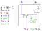

title: Pyrope, a modern HDL with a live flow
class: animation-fade
layout: true

<!-- This slide will serve as the base layout for all your slides -->
.bottom-bar[
  {{title}}
]

---

class: center, middle
background-image: url(https://masc.soe.ucsc.edu/images/masclogo3.png)
background-position: bottom center
background-repeat: no-repeat
background-size: 30%

.center[]

.center[### Sheng-Hong Wang, Haven Skinner, Akash Sridhar, Sakshi Garg, Hunter Coffman, Kenneth Mayer, Rafael T. Possignolo, Jose Renau]
.center[Computer Engineering]
.center[University of California, Santa Cruz]

---
name: default
background-image: url(https://masc.soe.ucsc.edu/logos/pyrope5.png)
background-position: bottom left
background-repeat: no-repeat
background-size: 10%

layout: true
task: &nbsp;

.task[{{task}}]

---
# Many Hardware Description Languages (HDL)

* Verilog, System Verilog

* Scala-based: Chisel<sup>*</sup>, SpinalHDL<sup>*</sup>

* Python-based: pyMTL, myHDL, pyRTL, migen

* Haskell-based: CλaSH<sup>*</sup>

* PSHDL<sup>*</sup>

* Bluespec

---
# Some problems with current HDLs

* DSL artifacts

* HW constructs

* Not fully synthesizable

* Unable to synthesize objects

* Unable to assimilate existing verilog

---

# HDLs tend to have DSL artifacts

```scala
// Chisel has == for SCALA, === for Chisel
io.v := y === UInt(0)

// pyRTL has special assigments
a <<= 3 // "assign, generated code"
a = 3   // "assign, in Python"
```

* Force designers to program with two languages at once:

Chisel, CλaSH, myHDL, pyMTL, pyRTL

---

# Many HDLs have strange HW constructs

```dart
a = 3
a = a + 1
assert(a==4); // may fail
```

* In several HDLs, the previous assertion may fail:

Chisel, SpinalHDL, CλaSH, PSHDL

Verilog (non-blocking)

---

# HDLs can be not fully synthesize

```verilog
a = 3
#3 // Not synthesizable
a = 4
```

* Some HDLs are not fully synthesizable which adds complexity:

myHDL, Verilog, System Verilog
---

# HDLs can not synthesize objects well

```scala
// no methods in input/outputs
a = input.get_value
```

* HDLs with synthesizable objects:

none
---

# Unable to Assimuilate Verilog

* Verilog is the current standard
* HDLs black-box Verilog modules
* Not much check across boundaries


* Ideally, a language should translate from Verilog to HDL

---

# Informal poll for lack of adoption of HDLs

--

* Verification does not improve with current HDLs. If any it gets harder.

--

* Steep learning curve for many HDLs (eg: CHISEL)

--

* Slower compilation and simulation

--

* Verilog vs HDL (Most tools handle Verilog not X-HDL)

   * Harder frequency/power/area feedback

   * Need to understand/debug generated verilog

---

# Pyrope, a modern HDL with a live flow

* Slow compilation and simulation

   * Live (under 30 secs) simulation, reload, and synthesis feedback goal

* Verification

   * Hot-Reload support, powerful assertions, source maps...
   * Allows Pyrope 2 Verilog, edit Verilog, Verilog 2 Pyrope, edit Pyrope...

* Steep learning curve, language artifacts

   * Modern and concise programming language, avoiding hardware specific artifacts
   * Static checks as long as they not produce false positives
   * Synthesis and simulation must be equal and deterministic
   * Zero cost abstraction

---

# Fast/Live Pyrope

* No includes, uses packages

* No DSL (most HDLs) that generate an executable to create code (not incremental)

* Integrated with LGraph to interact with annotations

* Hot Reload simulation capabilities

* Direct simulator generation to avoid intermediate Verilog pass

---

# Things that Pyrope can not do

* Generic programming language, Pyrope is synthesizable

* No recursion, neither function nor variable instantiation recursion

* Loops/iterators unbound at compile time

* Any IO, syscall... handled with external C++ modules

* rd/wr global variables

* No pointers. HDLs use hierarchy for references

---
task: Quick Dive to Pyrope
class: split-40r

# A counter with a pipeline stage

.lcolumn[
### Pyrope
```coffeescript
// code/counter.prp file
if $enable {
  #total := #total + 1
}
```
]

--

.rcolumn[
### Verilog
```verilog
module s1 (input  clk,
           input  reset,
           input  enable,
           output [3:0] total);
 reg [3:0] total_flop;
 reg [3:0] total_next;

 assign total = total_flop;

 always_comb begin
   total_next = total;
   if (enable)
     total_next = total + 1'b1;
 end

 always @(posedge clk) begin
   if (reset) begin
     total_flop <= 4'b0;
   end else begin
     total_flop <= total_next;
   end
 end
endmodule
```
]
--
.lbcolumn[
### Pyrope unit test
```coffeescript
// code/counter_test.prp file
b as counter ++ (__stage as true) // pipeline type
b.total as (__bits as 4)
b.enable = 0
I(b.total == 0)                // assertion
yield()                        // advance clock
I(b.total == 0)
b.enable = 1
I(b.total == 0)
yield(3)                       // advance 3 clock
I(b.total == 3)
```
]

---
task: Quick Dive to Pyrope
class: split-40

# A counter ~~with a pipeline stage~~

.column[
### Pyrope
```coffeescript
// code/counter.prp file
if $enable {
  #total := #total + 1
}
```

### Pyrope unit test
```coffeescript
// code/counter_test.prp file
*b as counter // ++ (__stage as true) // combination type
b.total as (__bits as 4)
b.enable = 0
I(b.total == 0)                // assertion
yield()                        // advance clock
I(b.total == 0)
b.enable = 1
*I(b.total == 1)
yield(3)                        // advance clock
*I(b.total == 3)
```
]

.column[
### Verilog
```verilog
module s2 (input  clk,
           input  reset,
           input  enable,
           output [3:0] total);
 reg [3:0] total_flop;
 reg [3:0] total_next;

* assign total = total_next;

 always_comb begin
   total_next = total;
   if (enable)
     total_next = total + 1'b1;
 end

 always @(posedge clk) begin
   if (reset) begin
     total_flop <= 4'b0;
   end else begin
     total_flop <= total_next;
   end
 end
endmodule
```
]

---
class: split-40
task: Quick Dive to Pyrope

# Testbenches

* Pyrope language testbenches are synthesizable
* Complex tests can interface with C++

.column[
### c++
```c++
// mysrc/test2.cpp file
#include "prp_cpp.hpp"

void prp_methodx(const prp_tuple &i ,prp_tuple &out) {
  Lconst       c = i.get(0);  //1st call arg
  prp_tuple    f = i.get(1);  //2nd call arg
  Lconst       b = f.get("b")) 
  p.set("res", i.get(0) + f.get("a") + f.get("b");
  p.set("mor", i.get(0) | f.get("a") | f.get("b");
}
```
```bash
$find . -type f
./code/test1.prp
./mysrc/test2.cpp
$prp --run test1.mytest ./mysrc/test2.cpp
```
]

.column[
### Pyrope
```coffeescript
// code/test1.prp file
mytest = ::{
  puts = import("io.puts")
  puts("Hello World")
  I(1 == 0+1)
  yield()
  c = 1
  f.a = 2
  f.b = 3

  m = import("methodx")
  a = m(c, f)
  I(a.res == 6)
  I(a.mor == 0b11)
}
```
]

---
task: Quick Dive to Pyrope

# A Ripple Carry Adder

```coffeescript
// libs/adder/code/rca.prp file
fa = :($a,$b,$cin,%sum,%cout):{    // method with explicit arguments
  tmp   = $a  ^ $b
  %sum  = tmp ^ $cin
  %cout = (tmp & $cin) | ($a & $b)
}

carry = $cin                       // 0 if RCA without carry in
for i in 0..a.__bits {             // iterate #bits
  tmp = fa(a[[i]],b[[i]],carry)    // function call to fa
  %sum[[i]] = tmp.sum
  carry     = tmp.cout
}
%cout = carry

test2 = ::{
  puts = import("io.puts")
  c = rca(a=32, b=4, cin=0)
  puts("sum is {0:b} {0}",c.sum)   // puts has c++ fmt in prplib
}
```

---
task: Quick Dive to Pyrope
# A Compact Ripple Carry Adder

```coffeescript
// libs/adder/code/rca2.prp file
c = $cin
for i in (0..$a.__bits) {
  %sum[[i]] = $a[[i]] ^ $b[[i]] ^ c
  c =  ($a[[i]] & $b[[i]]) | ($a[[i]] & c) | ($b[[i]] & c)
}

test = ::{
  for a in (1..100); b in (0..33); c in (0,1) {
    d = rca2(a=a, b=b, cin=c)
    I(d.sum == (a+b+c))
  }
}
```

```bash
$find . -type f
./libs/adder/code/rca2.prp
$prp --run libs.adder.rca2.test
```

---
task: Quick Dive to Pyrope

# A Carry Lookahead Adder

```coffeescript
// libs/adder/code/cla.prp file
and_red = import("lib.and_reduction")
%sum = rca(a=$a, b=$b, cin=0).sum

g = $a & $b // Generate
p = $a ^ $b // Propagate

// 4 bit: c = g[[3]] | g[[2]] & p[[3]] | g[[1]] & p[[3]] & p[[2]] |...
c = $cin & and_red(p)
for i in 0..a.__bits {
  _tmp = g[[i]]
  for j in (i..(a.__bits-1)) {
    _tmp = _tmp & p[[j]]
  }
  c = c | _tmp
}
%cout = c

test = ::{
  for a in (1..40) ; b in (1..100) {
    c1 = cla(a=a, b=b, cin=0)
    c2 = rca(a=a, b=b, cin=0)
    I(c1.cout == c2.cout)
  }
}
```

---
task: Quick Dive to Pyrope

# Specializing the adders

```coffeescript
// libs/adder/code/scla.prp file
cla = :($a,$b):{
  if $a.__bits==8 {
    s1 = cla(a=$a[[0..3]],b=$b[[0..3]],cin=0)  // cla for 4 bits
    t = generate($a[[0..3]],$b[[0..3]])        // generate carry method
    s2 = cla(a=$a[[4..7]],b=$b[[4..7]],cin=t)  // CLA with fast cin
    %sum = (s2.sum,s1.sum)[[]]                 // bit concatenation
  }elif $a.__bits==12 {
    s1 = cla(a=$a[[0..7]],b=$b[[0..7]],cin=0)  // .. Ruby style ranges
    t = generate($a[[0..6]],$b[[0..6]])        // generate carry method
    s2 = cla(a=$a[[6..11]],b=$b[[6..11]],cin=t)
    %sum = (s2.sum,s1.sum)[[]]
  }else{
    return rca(a=$a,b=$b,cin=0)
  }
}

test = ::{
  s = cla(3,5)
  I(s.sum == 8)
}
```

```bash
$prp --run libs.adder.scla.test
```

---
task: Quick Dive to Pyrope

# Customizing the counter

```coffeescript
// code/ccounter.prp file
..+.. = import("libs.adder.scla.cla")  // Overload + operator
if $enable {
  #total := #total + 1
  I(3 ..+.. 4 == 7 == 3 + 4)      // + is an alias for ..+..
}

my_add as import("libs.adder.scal.cla")
..+.. = :($a,$b):{
 // Special code for special case
}
```

.footnote[
  created with [remark](https://github.com/gnab/remark)
]

---
task: Quick Dive to Pyrope

# 3 Pipeline stage adder

```coffeescript
// code/add4.prp file
..+.. = import("libs.adder.scla.cla")
s1 = import("libs.adder.rca")

%sum.__stage = true
%sum1.__stage as true
%sum2 as (__stage=true)

sum1 = $a + $b
sum2 = $c + $c
%sum = s1(a=sum1.sum,b=sum2.sum,cin=0)

test = ::{
  b as add4(a=1,b=2,c=3,d=4)
  I(b.sum1 == 10 and b.sum2 ==  0 and b.sum ==  0)
  yield()
  I(b.sum1 == 10 and b.sum2 == 10 and b.sum ==  0)
  yield()
  I(b.sum1 == 10 and b.sum2 == 10 and b.sum == 10)
}
```

---
class: center, middle
background-image: url(https://masc.soe.ucsc.edu/logos/pyrope5.png)
background-position: bottom center
background-repeat: no-repeat
background-size: 20%

# Pyrope vs ...

---
class: split-40

# vs Verilog

.column[
### Verilog
```verilog
module vsverilog (input clk,
                  input reset,
                  input  [2:0] a,
                  input  [2:0] b,
                  output reg [3:0] c);

 always @(posedge clk) begin
   if (reset) begin
     c <= 3'b0;
   end else begin
     c <= a + b;
   end
 end

endmodule
```
]

.column[
### Pyrope
```coffeescript
// code/vsverilog.prp file
($a,$b) as (__bits=3, __bits=3)
%c = $a + $b
```
* No inputs/outputs
* Infer bit sizes
* Automatic reset to zero
* No reg/wire
* No blocking/non-blocking
]

---
class: split-50

# vs Verilog

.column[
### Verilog
```verilog
logic signed [3:0] a;
logic signed [4:0] c1;
logic signed [4:0] c2;
logic signed [4:0] c3;
logic        [1:0] u2bits;

always_comb begin
  a = -1;
  // verilog extends to max in op (a,c1,constant)
  // max bits is 5 (c has 5 bits)
  // a has 4 bits, so it should be extended to 5

  c1 = a + 1'b1;  // -16 (1 zero sign extend 15)
  c2 = a + 1'sb1; // -2  (1 sign extended -1   )
  c3 = a + 3'sb1; //  0  (0b001 sign extended 1)
  
end
```
]

.column[
### Pyrope
```coffeescript
// code/vsverilog2.prp file

a = -1s4bits
c1 = a + 1u    // 0 = -1 + 1
c2 = a + 1s    // 0
c3 = a + 1s3   /  0
```
]

---
class: split-40

# vs CHISEL

.column[
### CHISEL
```scala
import Chisel._
class GCD extends Module {
  val io = new Bundle {
    val a  = UInt(INPUT,  16)
    val b  = UInt(INPUT,  16)
    val e  = Bool(INPUT)
    val z  = UInt(OUTPUT, 16)
    val v  = Bool(OUTPUT)
  }
  val x  = Reg(UInt())
  val y  = Reg(UInt())
  when   (x > y) { x := x - y }
  unless (x > y) { y := y - x }
  when (io.e) { x := io.a; y := io.b }
  io.z := x
  io.v := y === UInt(0)
}
object Example {
  def main(args: Array[String]): Unit = {
    chiselMain(args, () => Module(new GCD()))
  }
}
```
]

.column[
### Pyrope
```coffeescript
if $a? and $b? {
  (#x,#y) = ($a,$b)
}else{
  if   #x > #y { #x = #x - #y }
  else         { #y = #y - #x }
  if #y == 0   { %z = #x      }
}
```
```coffeescript
test = ::{
  puts = import("io.puts")
  gcd as vschisel
  z = gcd(a=(1<<16).__rnd,b=(1<<16).__rnd)
  waitfor(z)
  puts("gcd for {} and {} is {}", a, b, z)
}
```
* Global type inference
* No scala vs chisel syntax
]

---
class: split-40

# vs CHISEL part 2

.column[
### CHISEL
```scala
// computes can overflow
val mask = ((1<<offset)-1) // wrong when offset>64

// Not possible to react to compiler info.
// Diplomacy does with one way
```
]

.column[
### Pyrope
```coffeescript
mask = (1<<offset)-1  // unlimited precession

uarts = punch("*.uart_set")
offset = 0
for i in uarts {
  i.addr = 0x100 + offset
  offset += 16
}

CI(uarts.__size >0) // compile time invariant
```
]


---
class: split-40

# vs Bluespec

.column[
### BSV
```verilog
module mkTb (Empty);
  Reg#(int) cycle <- mkReg (0);

  rule count_cycles;
    cycle <= cycle + 1
    if (cycle > 7) $finish(0);
  endrule

  int x = 10;
  rule r;
    int a = x;
    a = a * a;
    a = a - 5;
    if (pack(cycle)[0] == 0) a = a + 1;
    else                     a = a + 2;

    if (pack(cycle)[1:0] == 3) a = a + 3;

    for (int k=20;k<24;k=k+1)
      a = a + k;
    $display ("%0d: rule r, a=%0d", cycle, a);
  endrule
endmodule: mkTb
```
]

.column[
### Pyrope
```coffeescript
// code/vsbsv.prp file
#cycles := #cycles + 1
x = 10
a = x
a = a * a
a = a - 5
if cycle[[0]] == 0 { a = a + 1 }
else               { a = a + 2 }

if cycle[[0..1]] == 3 { a = a + 3 }

for k in 20..24 {
  a = a + k
}
puts = import("io.puts")
puts("{}: rule, a={}",cycle,a)
```
* More compact syntax
* More traditional language, no rules
]

---
class: split-40

# vs migen (Python HDL)

.column[
### migen
```python
from migen.fhdl.std import *
from migen.fhdl import verilog
class Blinker(Module):
  def __init__(self, led, maxperiod):
    counter = Signal(max=maxperiod+1)
    period = Signal(max=maxperiod+1)
    self.comb += period.eq(maxperiod)
    self.sync += If(counter == 0,
        led.eq(˜led),
        counter.eq(period)
      ).Else(
        counter.eq(counter - 1)
      )
led = Signal()
my_blinker = Blinker(led, 3000000)
print(verilog.convert(my_blinker, ios={led}))
```
]

.column[
### Pyrope
```coffeescript
// code/vsmigen.prp file
if #counter {
  #counter -= 1 // #counter-- does not work
}else{
  #counter = $maxperiod
  #led = ~#led // Not %, # is always valid
}

test = ::{
  puts as import("io.puts")
  b = vsmigen(maxperiod=300000)
  puts("led is {}",b.led)
  yield(300000)
  puts("led is {}",b.led)
}
```
* Avoid weird DSL syntax
]

---
class: split-40

# vs pyRTL (Python HDL)

.column[
### pyRTL
```python
def fibonacci(n, req, bitwidth):
    a = pyrtl.Register(bitwidth, 'a')
    b = pyrtl.Register(bitwidth, 'b')
    i = pyrtl.Register(bitwidth, 'i')
    local_n = pyrtl.Register(bitwidth, 'local_n')
    done = pyrtl.WireVector(bitwidth=1, name='done')

    with pyrtl.conditional_assignment:
        with req:
            local_n.next |= n
            i.next |= 0
            a.next |= 0
            b.next |= 1
        with pyrtl.otherwise:
            i.next |= i + 1
            a.next |= b
            b.next |= a + b
    done <<= i == local_n
    return a, done
```
]

.column[
### Pyrope
```coffeescript
// code/vspyrtl.prp file
if $n? {  // new request
  (#a,#b,#i) = (0,0,n)
}else{
  (#a,#b,#i) = (#b,#a+#b, #i-1)
}
if #i == 0 { %result = #a }
```
```coffeescript
test = ::{
  seq = (0,1,1,2,3,5,8,13,21,34)
  for n in 0..9 {
    n.__bits=6        // 6 bit fibonacci
    b = vspyrtl(n=n)
    waitfor(b.result)  // multiple clocks
    I(b.result == seq[n])
  }
}
```
* same issues as chisel
]

---
class: split-40

# vs PSHDL

.column[
### PSHDL
```dart
module de.tuhh.ict.Timing {
    out uint a=1,b=2,c=3,d=4;
    a=b;
    b=c;
    c=d;
    d=5;
    // a == b == c == d == 5
}

module de.tuhh.ict.Timing {
    out register uint a=1,b=2,c=3,d=4;
    a=b;
    b=c;
    c=d;
    d=5;
    // a==2, b==3, c==4, d==5
}
```
]

.column[
### Pyrope
```coffeescript
// code/vspshdl.prp file
// % is the output vector
% = (a=1,b=2,c=3,d=4)
%a = %b
%b = %c
%c = %d
%d = 5
I(% == (a=2,b=3,c=4,d=5))
```
* Avoid hardware driven syntax
]

---
class: split-40

# vs CλaSH

.column[
### CλaSH
```haskell
upCounter :: Signal Bool -> Signal (Unsigned 8)
upCounter enable = s
  where
    s = register 0 (mux enable (s + 1) s)
```
]

.column[
### Pyrope
```coffeescript
// code/vsclash.prp file
#upCounter.__bits as 8
if $enable {
 #upCounter += 1
}
```
* Easier to guess hw mapping
* More familiar syntax
]


---
class: split-40

# vs Liberty (LXE)

.column[
### Liberty
```dart
using corelib;
instance gen:source;
instance hole:sink;
gen.create_data = <<<
 *data = LSE_time_get_cycle(LSE_time_now);
 return LSE_signal_something | LSE_signal_enabled;
>>>;
gen.out ->[int] hole.in;
collector out.resolved on "gen" {
  header = <<<
#include <stdio.h>
    >>>;
  record = <<<
    if (LSE_signal_data_known(status) &&
        !LSE_signal_data_known(prevstatus)) {
      if(LSE_signal_data_present(status)) {
        printf(": %d\n", *datap);
      } else {
        printf(": No data\n");
      }
    }
  >>>;
};
```
]

.column[
### Pyrope
```coffeescript
// code/vsliberty.prp file
puts = import("io.puts")
gen  = ::{
  #data := #data + 1
}
sink = ::{
  if $data? {
     puts(": {}",$data)
  }else{
     puts(": No data")
  }
}
// ::{sink} to not call method now/defer call
s = ::{sink} ++ (__stage=true)
s.data.__bits = 3
g = ::{gen} ++ (__stage=true)
// Filter only odd data values
g |> ::{ if $.data[[0]] { return $ } } |> s
```
* Clean syntax
* No extra verbosity
* Similar handshake idea
]


---
class: split-40

# vs Dart

.column[
### dart
```dart
class Person {
  Person.fromJson(Map data) {
    print('in Person');
  }
}

class Employee extends Person {
  Employee.fromJson(Map data)
   : super.fromJson(data) {
    print('in Employee');
  }
}

main() {
  var emp = new Employee.fromJson({});
}
// Cascade operations
a..field1 = 1
 ..field2 = 2
```
]

.column[
### Pyrope
```coffeescript
// code/vsdart.prp file
puts = import("io.puts")
person.fromJson = ::{
  puts("in Person")
}

employee = person
employee.fromJson = ::{
  super($) // Notice, no fromJson
  puts("in Employee")
}

emp = employee.fromJson
// No cascade operations
a.field1 = 1
a.field2 = 2
```
* Prototype inheritance
* No memory (new/delete)
]

---
class: split-40

# vs Reason

.column[
### Reason
```dart
let increment x => x + 1;
let double    x => x + x;

let eleven = increment (double 5);

let add = fun x y => x + y;
let addFive = add 5;
let eleven = addFive 6;
let twelve = addFive 7;
```
]

.column[
### Pyrope
```coffeescript
// code/vsreason.prp file
increment = :($x):{$x + 1 }
double    = :($x):{$x + $x}

eleven = 5 |> double |> increment

add = :($x,$y):{$x + $y}
addFive = ::{ add }  // reference, no call
addFive = ::{ super(x=5,y=$y) }
eleven  = ::{ super(y=6) }
twelve  = ::{ super(y=7) }
```
* Pyrope has primitive currying
]

---
class: split-50

# vs Python

.column[
### Python
```python
class objectTest():
    def __init__(self,a):
      self.value = a
    def get_value(self):
      return self.value


a = objectTest(1)
b = objectTest(1)

assert a             != b
assert a.get_value() != b.get_value
assert a.get_value() == b.get_value()
assert a.get_value   != b.get_value

total = [x*x for x in range(10) if x % 2]
```
]

.column[
### Pyrope
```coffeescript
// code/vspython.prp file
objectTest.get_value = ::{
  return #this.myvalue
}
objectTest.set_value = :($a):{
  #this.myvalue = $a
  return this
}

a = objecttest.set_value(1)
b = objecttest.set_value(1)

I(a == b == 1)
I(a.get_value() == b.get_value)
I(a.get_value() == b.get_value())
I(a.get_value   == b.get_value)

total = (0..10) |> filter ::{$ & 1} |> map ::{$*$}
I(total == (1,9,25,49,81))
```
]

---
class: split-50

# vs MATLAB


.column[
### MATLAB
```matlab
x = 1:10
y = 10:-2:0
A = [1 2; 3 4]  # matrix 2x2

sum = 0;
for i=2:length(x)
   sum = sum + abs(x(i));
end

x3=(1:3).*2;
A = [1 0 3];
B = [2 3 7];
C = A.*B
% C = 2 0 21
C = A * B
% C = [[2 0 6] [3 0 9] [7 0 21]]
```
]

.column[
### Pyrope
```coffeescript
x = (1..10)
y = (10..0) ..by.. 2 // (10 8 6 4 2 0)
A = ((1,2),(3,4))

sum = 0
for i in 1..x.__size {
  sum = sum + abs(x(i))
}

x3=(1..3) ** 2  // parse error
I((2,4,6) == (1..3) * 2)
A = (1,0,3)
B = (2,3,7)
D = A * B  // ok sizes match
I(D == (2,0,21))
```
* Share tuple vs element operators
* Different applications/goals/...
]


---
class: split-50

# vs Coffeescript

.column[
### Coffeescript
```coffeescript
square = (x) -> x * x
eat    = (x) -> alert square x

eat x for x in [1, 2, 3] when x isnt 2

r361 = square 3 + square 4
r25  = square(3) + square 4
// r361 == 361 and r25 == 25

// Minimum number of parenthesis
y = pow 10, floor log10 x
// Equivalent to
y = pow(10, floor(log10(x)))

```
]

.column[
### Pyrope
```coffeescript
puts as import("io.puts")
square = :($x):{$ * $}
eat    = :($x):{puts(square(x=$)) }

for food in (1,2,3) {
  if food !=2 { eat(x=food) }
}

r=square(3 + square(4))// 361
r=square(3) + square(4)// 25

// Minimum number of parenthesis
y = pow(10,floor(log10(x)))
// Simpler syntax with pipes
y = x |> log2 |> floor |> pow(10)
```
* No iterators after statement
* Different rules about arguments
]

---
class: center, middle
background-image: url(https://masc.soe.ucsc.edu/logos/pyrope5.png)
background-position: bottom center
background-repeat: no-repeat
background-size: 20%

# Pyrope Syntax

---
class: split-50
# Basic Control Flow

.column[
### ifs
```coffeescript
// code/controlflow1.prp

if cond1 {
  I(cond1)
}elif cond2 {
  I(!cond1 and cond2)
}

unique if cond3 {
  I( cond3 and !cond4)
}elif cond4 {
  I(!cond3 and  cond4)
}else{
  I(!cond3 and !cond4)
}

unique if cond5 {
  I( cond5 and !cond6)
}elif cond6 {
  I(!cond5 and  cond6)
}
I(cond5 and cond6) // Unique implies full too
```
]

.column[
### while
```coffeescript
// code/controlflow2.prp
total = 0
{
  a = 0
  b = 0
  while total < a {
    a = a + 1
    total = total + 2
    if total > 100 {
      break
    }
  }
}
I(b==0) // compile error: b undefined
```
]

---
class: split-50
# For Loops Control Flow

.column[
```coffeescript
// code/controlflow3.prp
total = 0
for a in 1..3 { total += a }
I(total == (1+2+3))

total = 0
for a in 1..100 {
  if a[[0]] {
    continue
  }
  total += a
  if a > 10 {
    break
  }
}
I(total == (2+4+6+8+10))

total = 0 // compact double nested loop
for a in 1..3 ; b in (1, 2) { total += a }
I(total == (1+2+3 + 1+2+3))
```
]

.column[
```coffeescript
// code/controlflow4.prp
// loop initialization assignments
total = 0
a = 3;
for b in 0..3 ; c in (1,2) {
  I(a==3+b)
    a = a + 1
    if a>6 {
      break
    }
  total += a
}

total2 = 0
a = 3
for b in 0..3 {
  for c in (1,2) {
    I(a==3+b)
    a = a + 1
    if a>6 {
      break
    }
    total2 += a
  }
  if a>6 {
    break
  }
}
I(total2 == total)
```
]

---
class: split-50
# Element vs Tuple operator

.column[
### Basic ops
```coffeescript
// code/elementvstuple1.prp
// operators read left and right side

a = (1, 2, 3) + 4      // element op
I(a == (5, 6, 7))

a = (1, 2, 3) ++ (4, 5) // tuple concat
I(a == (1, 2, 3, 4, 5))

a = (1, 2, 3) ..+.. 4  // element op
I(a == (5, 6, 7))

// ..XX.. means operator XX
// .. are optional for non-alphanumeric operators
```
]

.column[
### custom operators
```coffeescript
// code/elementvstuple2.prp
..dox.. = :($a,$b):{  // .. is optional
  t = ()
  for a in $0 ; b in $1 {
    t ++= a+b
  }

  return t
}
I((1, 3) ..dox.. (2, 1) == (3, 2, 5, 4))

sub1 = ::{
  t = ()
  b = $1[0]   // first element in rhs
  for a in $0 {t ++= a+b}
  return t
}
// .. required in call to be operator
I((3, 2) ..sub1.. 1 == (2, 1))
I((3, 2) ..sub1.. (2, 3) == (1, 0))
```
]


---
class: split-50
# Input ($), Output (%), Register (#)

.column[
### Input/Outputs are tuples
```coffeescript
// code/ior.prp
add = ::{
  %total = 0   // % is the output tuple
  for i in $ { // $ is the input tuple
    %total = %total + i
  }
}

f = add(a=1, b=2)
I(f.total == f == 3)
```
]

.column[
### Registers and References
```coffeescript
// code/ior2.prp
ncalls = ::{
  #ncalled = #ncalled + 1
  % = #ncalled;
}

a = ncalls
I(a==1)
b = ncalls
I(b==2 and ncalls.ncalled == 2)
c = ncalls  // no call to ncalls
I(ncalls.ncalled==2)
d = ncalls+0  // calls to ncalls
I(ncalls.ncalled==3)
I(d==3)
e = c
I(ncalls.ncalled==3)
I(e==4==c)  // calls ncalls
I(ncalls.ncalled==4)
f = ncalls
I(f==5)
g = c
I(g==6)
I(ncalls.ncalled==6)

```
]

---
class: split-50
# Constraining Outputs

.column[
### Unconstrained
```coffeescript
// code/out1.prp
m1 = ::{
  // Registers are outputs by default
  %o1 = 1
  #o2 = #o2 + 1
}
v1 = m1()
I(v1.o1==1 and v1.o2==2)

m2 = ::{
  x = (o1=1,o2=3)
  #o2 = #o2 + 1 // not an output
  return x // force x as output
}
v2 = m2()
I(v2.o1==1 and v2.o2==3)
```
]

.column[
### Constrained output
```coffeescript
// code/out2.prp
m1 = :(%o1):{ // %o1 is single output
  %o1 = 1
  #o2 = #o2 + 1
}
v1 = m1()
I(v1.o1==v1==1)

m3 = :(%o1,%o3):{
  x = (o1=1,o2=2)
  return x    // compile error: o2 not valid
}

m3 = :(%o1,%o3):{
  %o2 = 3     // compile error: %o2 not valid
}
```
]

---
class: split-50
# Operator precedence

* Unary operators (!,~,#,?,%...) bind stronger than binary operators (+,++,-,*...)
* **Only** five levels of operator precedence (16 levels in c++)
* Always left-to-right evaluation
* Comparators can be chained (a==c<=d) same as (a==c and c<=d)
* mult/div precedence is only against +,- operators
* No precendence if left-right and right-left have same results

.column[
.small[
| Priority | Category | Main operators in category |
|:-----------:|:-----------:|-------------:|
| 1          | Unary       | not ! ~ # ? % $ |
| 2          | Mult/Div    | *, /         |
| 3          | other bin   | ..,^, &, -,+, ++, --, <<, >>, >>>, <<< |
| 4          | comparators |    <, <=, ==, !=, >=, > |
| 5          | logical     | and, or, then |
]
]

.column[
```coffeescript
// code/precedence1.prp
// Typically expected results
I((true or !false) == (true or (!false)))
I((3*5+5) == ((3*5) + 5))

a = x1 or x2==x3  // same as b = x1 or (x2==x3)
b = 3 & 4 * 4     // parse error: precedence
b = 3 + 3 - 5     // OK, same result right-left
b = 3*4-4         // same as (3*4)-4

c = (2) |> fcall(1)
I(c == fcall(1,2))

bar = x or y and z   // parse error
x = 3 ++ 4 -- 3      // parse error

c = a == 3 <= b == d   
I(c == (a==3 and 3<=b and b == d))
```
]

---
class: split-50
# Operator precedence

.column[
### explicit newline
```coffeescript
// code/precedence2.prp
bar = x == 3
   or x == 3 and !(x!=3)
   or false

bar = false or // parse error
      true     // parse error, ops after newline

I((true or false==false) == (true or (false==false)))

d = (1
    ,3)
e = (,,1,,,
    ,3,,) // Extra empty commas have no meaning
I(e==d)

bar = 3
    * 1 + 4
    * 3 - 1
I(bar == 3 * (1+4) * (3-1))
```
]

.column[
### explicit ;
```coffeescript
// code/precedence3.prp
x = 3 ++ 4 -- 3     // parse error: precedence
x = 3 ; ++ 4 -- 3   // OK, 3 ++ (4 -- 3)

b = !a or d         // OK, ! higher precedence
b = !a or c == d    // OK, == breaks expression
I(b == !a or (c == d))

bar = true or false and true // parse error
bar = true ; or true and false ; or true
I(bar == true or (true and false) or true)

I((1,3) == (,,,1,,,3,,))
f = 1 +;3                 // parse error
f = 1 ;+3                 // ugly but legal
```
]

---
# Single line syntax

```coffeescript
// code/singleline.prp
// ; is same as a newline
puts = import("io.puts")
if true { x = 3 }
if true {
x = 3 }
if true                   // parse error: extra newline
{ x = 3 }

if true { a = 3 puts(a) } // parse error: missing newline

c = 0
d = 0
if true { c = 1 ; d = 2 }
I(d == 1 and c == 2)
if true { e = 1 }
I(e == 1)                 // compile error: e undefined

for a in (1..3) {puts(a)}
I(a == 3)                 // compile error: a undef
```

---
class: split-50
# Code blocks

.column[
```coffeescript
// code/codeblock.prp file
puts as import("io.puts")
each as ::{
  for a in $ { $.__do(a) }
}

each(1,2,3)     ::{ puts($) }
(1,2,3) |> each ::{ puts($) }

map as ::{
  t = ()
  for a in $ {
    t ++= $.__do(a)
  }
  return t
}

a = ::{ 2+1 }       // OK implicit return

a = ::{ 1+1 ; 2+1 } // parse error: 1+1

s = (1,2,3) |> map ::{$+1} |> map ::{$*$}
I(s == (4,9,16))
```
]

.column[
```coffeescript
// code/reduce.prp file
reduce = ::{
  if $.__size <= 1 { return $ }

  redop = @$.__do   // reference, not function call
  tmp = $

  while true {
    tmp2 = ()
    for i in (0..tmp.__size by 2) {
      tmp2 ++= redop(tmp[i],tmp[i+1])
    }
    if tmp2.__size <=1 { return tmp2 }
    tmp = tmp2
    if tmp2.__size[[0]] {      // odd number
      tmp   = tmp2[[..-2]]     // all but last two
      tmp ++= redop(tmp2[-2..])// reduce last two
    }
  }
  I(false)
}
a = (1,2,3) |> reduce ::{$0 + $1}
I(a == 6)
```
]

---
class: split-50
# Code blocks II

.column[
```coffeescript
// code/codeblock2.prp file
dec_large = ::{
  for a in $ {
    if ($.__do(a)) {     // $.__do block
      % ++= $.__else(a)  // $.__else block
    }else{
      % ++= a
    }
  }
}

a = (1,2,3,10) |> dec_large ::{ $0 > 3 } else { $0-1 }
I(a==(1,2,3,9))
```
]

.column[
```coffeescript
// code/codeblock3.prp file
tree_reduce as ::{
  red_step as ::{
    for i in 1..$.__size by $width {
      % ++= $.__do($[i..(i+$width)])
    }
  }
  val = red_step($)    // Also pass code block
  I(val.__size<$.__size-1)
  while val.__size>1  {
    val = red_step($width, val, __do=@$.__do)
  }
  return val
}

a = (1,1,1,2,2,2,0,1,0)
a3 = a |> tree_reduce(width=3) ::{ // 2 levels
  for i in ${ % += i }
}
// ((1+1+1) + (2+2+2) + (0+1+0))
I(a3==10)
a2 = a |> tree_reduce(width=2) ::{ // 4 levels
  for i in ${ % += i }
}
// ((((1+1) + (1+2)) + ((2+2) + (0+1))) + ((0)))
I(a2==10)
```
]

---
class: split-50
# Variable scope

.column[
### Method contructs
```coffeescript
// code/scope1.prp
a = 1
b = ::{
  d = 3    // b local scope
  %out = a // compile error: a undefined
}
x = b
I(a == 1)
c = ::{
  a = 2    // local variable
  d = 4
  %out = a
}
I(d==4)    // compile error: d undefined
I(c.out == 2)
```
]


.column[
### Control flow constructs
```coffeescript
// code/scope2.prp
a = 1
if a == 1 {
  a = 2
  b = 3
}
I(a == 2)
I(b == 4) // compile error: b undefined

total = 0  // needed
for i in (1..3) { total += i }

I(total == 1+2+3)
I(i == 3) // compile error: i undefined

#val = 3
#val_link = punch("#scope2.val")
I(#val_link == 3)
#val = 1
I(#val_link == 1)
```
]

---
# Dealing with references

* Pyrope allows reference. This shows how the code is generated before optimization

.center[]


---
class: split-50
# Scope outside code regions

.column[
### Allow to "punch" wires through stages
```coffeescript
// code/scope5.prp
n2 = ::{
  n1 = ::{ %o = 1 ; #r = 3 }
}
n3 = ::{
  // Punch a wire through n2/n1 hierarchy
  $p1 = punch("%n2.n1.o")
  %o2 = $1 + 1
  #p2 = punch("#n1.r")
  %o4 = #p2 + 1
}
$i1 = punch("%n2.n1.o")
$i2 = punch("%scope5.n2.n1.o")
I(n3.o2 == 2)
I(n3.o4 == 4)
```
]

.column[
### Multiple matches
```coffeescript
// code/scope6.prp
nested1_3b = ::{
  nested2 = ::{
    #cycle.__bits as 3
    #cycle += #incr
  }
}
nested1_5b = ::{
  nested2 = ::{
    #cycle as (__bits=5)
    #cycle += #incr
  }
}
#n2_links = punch("#nested2")
for i in #n2_links {
  i.incr = i.__index + 1
}
I(#n2_links[0].id == 1)
I(#n2_links[1].id == 2)
```
]

---
class: split-50
# Implicit vs Explicit arguments

.column[
```coffeescript
// code/impvsexp1.prp file
a = (1,2+3,3)           // tuple
a = f(1,2,f2(3))        // function call
b = (1
    ,2-3)               // 2 lines
a = f(1
      ,2-4*fcall(3-1))  // 2 lines function call
```

* Extra commas have no impact

```coffeescript
// code/impvsexp2.prp file
a = (,,,1,,,,2,,,,3,,,)
a = f(,,,1,,2,,3,,,)
b = (1+23*fcall(2+4))
```
]

.column[
* Tuple assignments

```coffeescript
// code/impvsexp3.prp file
a = (1,3)
I(a==(1,3))
(a,b) = 3
I(a == 3 and b == 3)
(a,b) = (3,4)
I(a == 3 and b == 4)
(a,b) = (b,a)
I(a == 4 and b == 3)
```
]

---
# Namespace

```coffeescript
// dir1/code/scope1.prp file
// directories are namespaces (dir1 in dir1/code/scope1.prp)
// code*, src*, test*, _*, and *_ do not create namespace

puts as import("io.puts")   // puts only visible to this file
scope1_m1 = ::{ 1 }
scope1_m2 = ::{ 1 }
```

```coffeescript
// dir1/code/scope2.prp file
puts = import("io.puts")    // redundant (exported in scope1.prp)
puts("{} == 1", scope1_m1)  // exported in scope1.prp
```

```coffeescript
// dir2/code/scope1.prp file
puts = import("io.puts")
puts("{} == 1", scope1_m1)  // compile error: exported in dir1
```

```coffeescript
// dir2/_hid/src3/code/dir73_/scope2.prp file
puts = import("io.puts")
sc1 = import("dir1.scope1_m1")
puts("{} == 1", sc1)        // calls scope1_m1
```

---
# Function call arguments

```coffeescript
// code/fcalls.prp file
puts = import("io.puts")   // puts only visible to this file

square = :($x):{$x * $}    // $ has a single element, so $x == $
r=square(3, 4)             // compile error, square has 1 argument, 2 passed
r=square (3)               // compile error, space after variable name
r=square(3 + (square(4)))  // OK, 361 = (3_4^2)^2 ; ^ is exp, not xor
r=square(3 + square(4))    // OK, 361
r=square(3 + square(4))    // OK, 361
r=square(3) + square(4)    // OK, 25
pass  = ::{
  if $.__size == 1 { return 7 }
  if $.__size == 2 { return 9 }
  11
}
puts(3,pass(),4,5)          // OK, prints "3 11 4 5"
puts(3,square(4),5)         // OK, prints "3 16 5"
puts(,,3,,,,pass,,,,5,,)    // OK, prints "3 11 5"
puts(3,pass(4),5,,pas(3,4)) // OK, prints "3 7 5 9"

a = fcall1(a=(1,2),b=3,d=(a=1,b=3)) // a function call is a tuple
```

---
# this vs super

```coffeescript
// code/thissuper.prp file

o.x.data = 1
o.x.data_plus_1 = ::{ 
  I(this.__key == "x")
  I(this.data.__key == "data")
  // this accesses the parent tuple o.x
  this.data+1 
}
o.x.cb_chain = ::{}
x = o.x // copy object

x.cb_chain // does nothing
x.cb_chain = ::{ 
  I(super.__key == "cb_chain")
  I(this.__key == "x")
  super($) // Calls cb_chain before this redefinition
  this._my_data = this._my_data+1
}
x.cb_chain
I(x._my_data==1)

x.cb_chain = ::{ 
  super($) // Calls cb_chain before this redefinition
  this._foo = 2
}
I(x._my_data==2 and x._doo==2)

// o.x does not have _foo ()
o.x.cb_chain // does nothing
```

---
# Everything is a tuple

```coffeescript
// code/alltuples.prp file

a = 1
b = (1)
I(a.__size==b.__size==1)

c = (1,2)
d = a ++ b
I(c.__size==d.__size==2)

I(a.0==b[0]==c.0==d[0])
I((((a[0])[0]).0)[0]==1)
```

---
class: split-50

# Tuples

.column[
### Tuples are ordered heterogeneous
```coffeescript
// code/tuples1.prp
a = (b=1,c=2)              // ordered, named
I(a.b == 1 and a.c == 2)
I(a.0 == 1 and a.2 == 2)

b =(3,false)               // ordered, unnamed
I(b.0 == 3 and b[1] == false)

c1.b.__bits = 1
c1.c.__bits = 3
c as (c=0, b=1)            // final ordered named
c as c1                    // fix bits
I(c.c==0 and c.b==1)
c = (true,2)
c = (false,33) // compile error: 33 > bits=3
c.bar = 3      // compile error: bar undefined

d as (a=3,5)   // final, ordered, unnamed
I(d.a == 3 and d[1] == 5)

g = (1,2,3)
I((1,3) ..in.. g)
g ++= (2,5)

e.0 = 3        // unamed, ordered
I(e.0 == 3 and e == 3)
```
]

.column[
### Complex tuples
```coffeescript
(e1, e2) = (1, 2)
I(e1==1 and e2==2)
(e1, e2) = (3)       // compile error: tuple sizes

(f,g) = 3
I(f==3 and g==3)
(f,g) as (field=1, field=1)
I(f.field==1 and g.field==1)

a = (b=1, c as 2)
a.b=3                // OK to change
a.c=3                // compile error: c was fixed
a.d=3                // OK, new field

a ++= (d=4)
I(a.d==4 and a.b==1)

d as (b=1, c=2)
d.b = 10             // OK
d.e = 1              // compile error: e undefined
d ++= (e=4)          // compile error: d was fixed
```
]

---
class: split-50

# Tuples II

.column[
### Tuple operations
```coffeescript
// code/tuples3.prp

a = (1,2)
b = a ++ 3
I(b==(1,2,3))

c = a ++ b
I(c == (1,2,1,2,3))
I(c.0==1 and c.1==2 and c.3==1)
I(c[0]==c.0 and c[1]==c.1)

d.a=1
d.b=2
d.c=3

e.f=4
e.g=5

g = d ++ e
I(g.a==1 and g.f==4)
I(g == (a=1,b=2,c=3,f=4,g=5))
xx = g[0]     // compile error, unordered tuple
I(g["a"]==g.a)

h = (a=1,b=2)
j = h ++ (c=3) // ordered named tuple
I(j[0]==1==j.a and j[2]==j.c==3) 
```
]

.column[
### Tuple hierarchy (big endian)
```coffeescript
// code/tuples4.prp

t1.sub.a = 1
t1.sub.b = 2
t1.c =3

t2 = (sub=(a=1,b=2),c=3)
I(t1==t2)
I(t2[0][0]==1 and t2[0][1]==2 and t2[1]==3)
xx = t1[0][0] // compile error, unordered tuple

t3 = t1.sub
I(t3.a==1 and t3.b==2)
```
]
---
class: split-50

# Tuples Endian

### Pyrope follows the big endian convention from SystemVerilog

.column[
```coffeescript
// code/tupleendian.prp

s = (b1=0x12, h2=(b2=0x34,b3=0x56), b4=0x78)

// big endian consistent with packed System Verilog
tmp = s[[..]] // flatten pick bits (big endian)
I(tmp == 0x12345678)
I(s[[0..7]]==0x78)
I(s[[8..16]]==0x56)

/* SystemVerilog equivalent
typedef struct packed {
  logic [7:0] b2;
  logic [7:0] b3;
} hw_t;

typedef struct packed {
  logic [7:0] b1;
  h2_type     h2;
  logic [7:0] b4;
} s_t;
 */
```
]

.column[
### Tuple hierarchy (big endian)
```coffeescript
// code/tuplecpp.prp

s = (a=0x12,b=(c=0x33,d=0u8bits))
s.b.d = $inp

call_cpp = import("my_fcall")

out = call_cpp(s)
I(out.total==(0x12+0x33+$inp))

/* C++ sample interface (no struct generated)
void my_fcall(const prp_tuple &inp, prp_out &out) {
  auto a = inp.get("a");
  auto b = inp.get("b");
  auto c = b.get("c");
  auto d = b.get("d");
  auto total = a + c + d;
  out.set("total", total);
}
 */
```
]

---
# Tuples vs Scalar

### A scalar is a tuple of size 1

```coffeescript
// code/tuplescalar.prp file
my_func::{
  a = 3             // scalar
  foo = a           // scalar, 3
  a = a ++ 4        // tuple, (3,4)
  b = a             // tuple, (3,4)
  c = b.0           // scalar, 3
  d = a[1]          // scalar, 4
  %out = c + d      // scalar, 7
  %out = %out ++ a  // tuple, (7, 3, 4)
  %out2 = a ++ %out // tuple, (3, 4, 7, 3, 4)
  %out3 = foo       // scalar, 3 
}
result = my_func()  // hier-tuple
I(result == (out=(7, 3, 4), out2=(3, 4, 7, 3, 4), out3=3))
%out = result.out.0 + result.out2.4 + result.out3 // 7 + 4 + 3 = 14
```

---
class: split-50
# Sets and Enums

.column[
### Sets
```coffeescript
// code/sets1.prp
s.__set=true
s = (1, 2, 3, 3)
I(s == (1,2,3))
s ++= 4  // add to tuple
s = s ++ (1,4,5)
I(s == (1,2,3,4,5))

a = 1..3
a.__set = true
I(a == (1,2,3))
I(a[[]] == 0b1110)

I(c == (0..3))
I(0b1010.__set == (1,3))

a.__allowed as 0..127 // 128 bit vector set
a.__set as true
a[$i1] = true
I(a[$i3]) // run-time check

b = a[3]
b.__comptime = true
I(b) // b known at compile time
```
]

.column[
### Enumerate
```coffeescript
// code/enums1.prp

// Plain tuple with fixed (as) fields
tup = (Red as 1,Blue as 2,Purple as 3)
I(tup.Red == 1)
(a,b,c) = (a,b,c) |> set_field("__allowed", tup)
c = tup.Red        // OK
b = 3              // OK, allowed value
a = 5              // compile error

// enum is a strict in style allowed tuple
tup2 as tup
d.__enum as tup2   // sets __allowed too
d = tup2.Red       // OK d[[]]==1
d = tup.Red        // compile error, tup is not enum
d = 1              // compile error
```
]

---
class: split-50
# Tuples and Bitwidth at compile time

### Once the hierarchy is known all the tuples and bitwidth should be known at compile time

.column[
### Tuples at compile time
```coffeescript
// code/tuples5.prp
a = 3
if true {
  a = a ++ 4
}else{
  a = 5
}
I(a==(3,4)) // if decided at compile time

b = 3
if $runtime_val {
  b = b ++ 4
}
I(b.0==3)
// tuple size must be know at compile time
I(b.1==4) // compile time error
```
]

.column[
### Bitwidth at compile time
```coffeescript
// code/bitwidth2.prp

a = 1u2bits
b = a + 1
I(b.__bits == 2)

c = 3u3bits
if $runtime_val {
  c = 8u4bits
}else{
  c = 6u6bits
}
I(c.__bits = 6)
```
]

---
class: split-50

# Memories (Unconstrained)

.column[
```coffeescript
// code/mem1.prp

// Size inferred from $addr.__bits
// Width inferred from $wdata.__bits

if $we {
  #mem[$addr] = $wdata
  %out = $wdata
}else{
  %out = #mem[$addr]
}

```
]

.column[
```coffeescript
// code/mem2.prp

// SRAMs at posedge by default
// $wdata+1 MUST be moved prev cycle
new_data = $wdata + 1   
#mem[$waddr] = new_data

rd = #mem[$waddr]  // 1 cycle read delay, no fwd
I(rd == #last_cycle_new_data)

#last_cycle_new_data = new_data
```
]

---

# Memories (Selecting ports with latency/fwd)

```coffeescript
// code/mem3.prp

#mem.__size = 1024
#mem.__port = (rd2n=(__latency=2,__fwd=false),
               rd1n=(__latency=1,__fwd=false),
               rd1f=(__latency=1,__fwd=true),
               rd0n=(__latency=0,__fwd=false),
               rd0f=(__latency=0,__fwd=true),
               wr=(__latency=1))

#cycle.__bits = 128 // Create long cycle
#mem.wr[33] = #cycle & 0xFFF // infer __bits=12

I(#mem.rd0f[33] == #cycle) // 0 clk and fwd
I(#mem.rd1f[33] == #cycle) // 1 clk and fwd

I(#mem.rd0n[33] == #last )           // 0 rd clk + 1 wr clk
I(#mem.rd1n[33] == #last_last )      // 1 rd clk + 1 wr clk
I(#mem.rd2n[33] == #last_last_last ) // 2 rd clk + 1 wr clk

#last_last_last  = #last_last
#last_last       = #last
#last            = #cycle
#cycle          := #cycle + 1
```

---
class: split-50

# Memories (Reset FSM and Forwarding)

.column[
```coffeescript
// code/mem_nfwd.prp
// No port constraints

#a.__reset_cycles = 2000
#a.__reset = ::{
   #wr_addr.__bits = 8
   this[wr_addr] = wr_addr
   #wr_addr := #wr_addr + 1
}

I(#a[ 1] ==  1)
I(#a[32] == 32)

#cycle.__bits = 128

#a[16] := #next
if #cycle == 0 {
  I(#a[16]==16)
}else{
  curr_data = #cycle & 0xFF // lower 8 bits
  next_data = #next  & 0xFF // lower 8 bits
  I(#a[16]==curr_data) // __fwd=false

  I(#a[16].__q_pin == curr_data)
}

#cycle = #cycle + 1
#next  = #cycle + 2
```
]

.column[
```coffeescript
// code/mem_fwd.prp
*// Constraint all ports to do fwd
*#a.__ports = (__fwd=true) //unlimited #ports
#a.__reset_cycles = 2000
#a.__reset = ::{
   #wr_addr.__bits = 8
   this[wr_addr] = wr_addr
   #wr_addr := #wr_addr + 1
}

I(#a[ 1] ==  1)
I(#a[32] == 32)

#cycle.__bits = 128

#a[16] := #next
if #cycle == 0 {
  I(#a[16]==16)
}else{
  curr_data = #cycle & 0xFF // lower 8 bits
  next_data = #next  & 0xFF // lower 8 bits
*  I(#a[16]==next_data) // __fwd=true

  I(#a[16].__q_pin == curr_data)
}

#cycle = #cycle + 1
#next  = #cycle + 2
```
]

---
class: split-50

# Memories (Clock and edge select)

.column[
### No time for logic error
```coffeescript
// code/mem_edge1.prp
// Enforce #rd and wr ports in SRAM
#cycle as (__bits=8)

#cycle += 13  
// +13 can not move to prev cycle. Comb loop
// flop -> add 13 -> flop
// flop -> add 13 -> SRAM (posedge)
#a[#cycle] = 0x33 // error: oop! same cycle+13

#b.__ports.__posedge=false
#b[#cycle] = 0x33 // OK (half cycle for +13)
```
]

.column[
### Posedge/Negedge
```coffeescript
// code/mem_edge2.prp
#pos_cycle.__bits = 128
#pos_cycle.__posedge = true
#neg_cycle.__bits = 128
#neg_cycle.__posedge = false

// clk  = 01010101010101010
// pos  =  aabbccddeeffgghh
// neg  = aabbccddeeffgghh
// rd1p =      aabbccddeeffgghh    1 wr + 1 rd clk
// rd2p =        aabbccddeeffgghh  1 wr + 2 rd clk
// rd1n =       aabbccddeeffgghh   1 wr + 1 rd clk
// rd2n =         aabbccddeeffgghh 1 wr + 2 rd clk

#a.__bits = 8
#a.__port = (rd1p=(__posedge=true)
            ,rd1n=(__posedge=false)
            ,rd2p=(__posedge=true,__latency=2)
            ,rd2n=(__posedge=false,__latency=2)
            ,wr =(__posedge=true))

#a.wr[33u8] := #pos_cycle

#pos_cycle := #pos_cycle + 1
#neg_cycle := #neg_cycle + 1 // neg ahead of posedge
```
]
---
class: split-50

# Memories (Structural)

.column[
```coffeescript
// code/mem_struct1.prp
a = cell("memory")

a.__size = 32
a.__bits = 64
a.__port[0].__clk_pin = clock
a.__port[0].__posedge = true
a.__port[0].__latency = 1
a.__port[0].__fwd     = true  // NOT default
a.__port[0].__addr    = rd0_addr
a.__port[0].__enable  = true
rd0_data = a.__port[0].__data

a.__port[1].__clk_pin = clock
a.__port[1].__posedge = true
a.__port[1].__latency = 1
a.__port[1].__fwd     = true  // NOT default
a.__port[1].__addr    = rd1_addr
a.__port[1].__enable  = true
rd1_data = a.__port[1].__data

a.__port[2].__clk_pin = clock
a.__port[2].__posedge = true
a.__port[2].__latency = 1
a.__port[2].__fwd     = false
a.__port[2].__addr    = wr_addr
a.__port[2].__enable  = wr_enable
a.__port[2].__data    = wr_data
```
]

.column[
### Automatic port select
```coffeescript
// code/mem_struct2.prp
// Ports anonymous and identical can auto pick
#mem.__port = (__fwd=true)

rd0_data = #mem[r0_addr] // pick a port
rd1_data = #mem[r1_addr] // pick a port

if wr_enable {
  #mem[wr_addr] = wr_data // Pick a port
}
```
]

---
class: split-50

# Memories (write-mask)

.column[
```coffeescript
// code/mem_wr.prp

#mem.__size = 1024
#mem.__bits = 14
$a.__bits = 8
$b.__bits = 4

// default reset to zero all entries

c = 3u2

#mem[$addr].a = $a // 1 wr port (all same address)

if $rand_input {
  #mem[$addr].field2 = $b
}else{
  #mem[$addr].c = c
}

%out = $mem[$rd] // read a,b,c
I(%out.c == 0 or %out.c==3u2)
%out.xx = $mem[$rd2].c // read just c
```
]

.column[
### Structural generated
```coffeescript
// code/mem_wr2.prp

#mem.__size = 1024
#mem.__bits = 14

c = 3u2

___data.a = $a
___wrmask = 0x0FF

if $rand_input {
  ___wrmask = __wrmask | 0xF00
  ___data.field2 = $b
}else{
  ___wrmask = __wrmask | 0x3000
  ___data.c = c
}

#mem.__port[0].__wrmask = ___wrmask
#mem.__port[0].__addr   = $addr
#mem.__port[0].__data   = ___data

#mem.__port[1].__addr = $rd
%out = #mem.__port[1].__data

#mem.__port[2].__addr = $rd2
%out.xx = #mem.__port[2].__data.c
```
]

---
class: split-50

# Memories (Enable and port limits)

.column[
```coffeescript
// code/mem_enable.prp

// Low level structural memory
a = cell("memory")

a.__size = 1024
a.__bits = 8
a.__port[0].__addr    = rd0_addr
a.__port[0].__enable  = rd0_enable
rd0_data = a.__port[0].__data

a.__port[1].__addr    = wr0_addr
a.__port[1].__enable  = wr0_enable
a.__port[1].__data    = wr0_data

// Equivalent pyrope code

I(rd0_addr.__bits==10) // 2**10 = 1024
I(rd0_data.__bits==8)
I(wr0_addr.__bits==10) // 2**10 = 1024
I(wr0_data.__bits==8)

if rd0_enable {
  rd0_data = #mem.rd0[rd0_addr]
}

if wr0_enable {
  #mem.wr0[rd0_addr] = wr0_data
}
```
]

.column[
### Explicit ports used each read
```coffeescript
// code/mem_port.prp
#mem.__port = (rd=(__fwd=true)
              ,wr=()
              ,dg=(__debug=true))

rd0_data = #mem.rd[$rd_addr] // OK
xxx      = #mem.rd[$rd_addr] // OK, same addr
yyy      = #mem.rd[$rd_addr+1] // comp error

if wr_enable {
  #mem.wr[$wr_addr] = $wr_data   // dropped
  #mem.wr[$wr_addr] = $wr_data+1 // ok
  #mem.wr[$wr_addr+1] = $wr_data // comp error
}

a = #mem.dg[$rand] // dg as __debug not count as read
b = #mem.dg[$rand] // dg as __debug not count as read
c = #mem.dg[$rand] // dg as __debug not count as read
%out = a + b + c
```
]

---
class: split-50

# Compiler Parameters

.column[
### Flop/Latches Specific
```
 __posedge       Posedge (true) or negedge
 __q_pin         Previous cycle value, no fwd (registers)
 __fwd           Perform forwarding in cycle (true)
 __latch         Latch not flop based (false)
 __clk_pin       Wire signal to control clk pin
 __reset         Code block to execute during reset
 __reset_pin     Wire signal to control reset pin
 __reset_cycles  Number of reset cycles required (1)
 __reset_async   Asynchronous reset (false)
 __last_value    Read last write to the variable/tuple
 __stage         stage or comb submodule (false)
 __fluid         Outputs in module handled as fluid
```
### SRAM Specific
```
 __size          number of entries SRAMs
 __port          tuple with ports in SRAM
    __debug      Port debug (false), no side-effects
    __clk_pin    Port clock
    __posedge    Port posedge (true) or negedge
    __latency    Read or Write latency (1)
    __fwd        Perform forwarding (false) in cycle
    __addr       Address pin
    __data       Data pin
    __wrmask     Write mask pin
    __enable     Enable pin
```
]

.column[
### Generic bitwidth
```
 __sign          Sign vs unsigned variable (false)
 __allowed       Allowed values in variable
 __bits          Number of bits
 __max           Alias for maximum __allowed value
 __min           Alias for minimum __allowed value
```
### Generic
```
 __key           string key name for instrospection
 __rnd           Generate an allowed random number
 __rnd_bias      Controls random generation
 __comptime      Fully solved at compile time
 __debug         Debug statment, no side effects
```
### Tuple
```
 __size          number of entries in tuple
 __set           Tuple behaves like a set (false)
 __enum          Tuple values become an enum
 __index         tuple position (typically for loops)
 __do            Code block passes ($.__do)
 __else          Else code block ($.__else)
```
]

---
class: split-50

# Ranges

.column[
### Basic
```coffeescript
// code/ranges1.prp
I((1,2,3) == 1..3)
I((1,2,3) == (1..3))

I(((0..7) ..by.. 2) == (0, 2, 4, 6))
I((1..2) ..or.. 3 == (1..3))
I((1..10) ..and.. (2..20) == (2..10))

// ranges can be open
I((3..) ..and.. (1..5) == (3..5))
I((..)  ..and.. (1..2) == (1..2))
I((..4) ..or..     (2..3) == (..4))

I((..)   ..and.. (2..7) == (2..7))
I((0..)  ..and.. (2..7) == (2..7))
I((..-1) ..and.. (2..7) == (2..7))
I((..-2) ..and.. (2..7) == (2..6))
I((3..-2) ..and.. (2..7) == (3..6))

// closed ranges are like sets
I((1..3)[[]] == (1,2,3)[[]])
I(0b0010101.__set == (0,2,4))
I(0b0011110.__set == (1..4))
```
]

.column[
### Complex
```coffeescript
// code/ranges2.prp
seq = (1..9)

start  = seq[0..2]
middle = seq[3..-2]
end    = seq[-2..]
copy   = seq[..]

I(start  == (1,2,3))
I(middle == (4,5,6,7))
I(end    == (8,9))
I(copy   == (1,2,3,4,5,6,7,8,9))

val = 0b11_01_10_00
I(0..2 == (0,1,2))

I(val[[2..0]]   == val[[(2,1,0)]] == 0b000)
I(val[[0..2]]   == val[[(2,1,0)]] == 0b000)
I(val[[-1]]     == val[[-1]]      == 0b1)   // MSB
I(val[[-1..-3]] == val[[(-1,-2,-3)]]== 0b110)
I(val[[-1..1]]  == val[[(1,0,-1)]]== 0b001)

I((1..3) * (2,2,2) == (2,4,6))
I((1..3) + (2,2,2) == (3,4,5))
I((1..3) + 2 == (3..5))  // compile error
I((1,2,4) ++ 3 == (1..4))
```
]

---
# Random number generation

### rnd and rnd_bias interface. Seed controller by environment variable.

```coffeescript
// code/rndtest.prp
puts = import("io.puts")
a = __rnd(1..3)          // rnd between 1 2 3
b.__bits=12
a = b.__rnd              // rnd from 0 to 4095
b.__rnd_bias =   (1, 0)  // weight 1 for value 0
b.__rnd_bias ++= (2, 3)  // weight 2 for value 3
b.__rnd_bias ++= (2 ,4)  // weight 2 for value 4
b.__rnd_bias ++= (5, 9)  // 0 10%, 3 20%, 4 20%, and 9 50% chance

c.__bits as 8
c.__rnd_bias   = (1 ,0)     // weight 1 for value 0
c.__rnd_bias ++= (2 ,255)   // weight 2 for value 255
c.__rnd_bias ++= (7,1..254) // weigth 7 for the rest
puts(c.__rnd)               // 10% chance 0, 20% chance 255, 70% other
```

```bash
$export PRP_RND_SEED=33
$prp --run rndtest
```


---
# Resets

```coffeescript
// code/reset1.prp
#a.__bits as 3
#a.__reset = ::{ this = 13 }

#b as (__bits=3, __reset_pin=false) // disable reset

#mem0 as (__bits=4, __size=16)
#mem0.__reset = ::{ this = 3 }

#mem1 as (__bits=4,__size=16, __reset_pin=false)

#mem2 as (__bits=2,__size=32)

// complex custom reset
#mem2.__reset_cycles = #mem2.__size + 4
#mem2.__reset = ::{
  // Called during reset or after clear (!!)
  #_reset_pos as (__bits=log2(#this.__size),__reset_pin=false)
  #this[#_reset_pos] = #_reset_pos
  #_reset_pos += 1
}
```

---
# Multiple Clocks

### Each flop or fluid stage can have its own clock

```coffeescript
// code/clk1.prp

#clk_flop = $inp
// implicit #clk_flop as __clk_pin=$clk
#clk2_flop as (__clk_pin=$clk2)
#clk2_flop = #clk_flop

%out = #clk2_flop
%out as (__fluid=true)
%out as (__clk_pin=$clk3)  // 3rd clock for output
```

---
# Constants

```coffeescript
// code/constants.prp

a = 3                     // implicit __bits=2 __sign=false
a = 3u                    // explicit __sign=false, implicit __bits=2
a = 3u4bits               // explicit __sign=false, __bits=4

b = 0xFF_f__fs32bits      // explicit __bits=32 __sign=true

c = 0b_111_010_111u32bits
c = 0b_111_010_111u2bits  // compile error

c = 0xFF[[0..2]]          // explicit drop bits
```

---
# Compile time assertions and checks

```coffeescript
// code/assertions.prp

a = 3
a.__comptime = true
b = a  // b and a must be known at Compile time

if a==3 {       // compile time if condition
  I(true)       // runtime assertion
  %d = $0+a     // no constant
}

CS as I
CS.__comptime=true
CI(a == b)      // compile time assertion

I(%d != a)      // runtime assertion
```

---
class: split-50
# Bit precision

.column[
### Explicit vs implicit
```coffeescript
// code/precission1.prp
a = 2       // implicit, __bits=2
a = a - 1   // OK, implicit __bits=1

b = 3u2bits // explicit, __bits=2
b = b - 2   // OK, bits=2
b = b + 2   // compile error, __bits explicit 2
I(b == 2)
b := b + 2  // OK (drop bits)
I(b == 0)   // 4u2bits -> 0b100[[0..1]] == 0

// implicit unless all values explicit
c = 3 - 1u1bits // implicit, __bits=2 __allowed=2u2bits

#d.__allowed as (0, 1, 7) // allowed values
#d = 0      // OK
#d += 1     // OK
#d += 1     // runtime error: not allowed value

I(0b11_1100 == (a, 0b1100)[[]]) // bit concatenation
```
]

.column[
### Conditions
```coffeescript
// code/precission2.prp
a.__allowed as 1..6
a = 5
c = 5
if xx {
  a = a + 1  // OK
  c = c + 1
}else{
  a = a - 4  // OK
  c = c - 4
}
a = a + 1  // runtime error: out range
I(c.__allowed == (1,6)) // all possible values
c = c + 2
I(c.__allowed == (3,8) and c.__bits == 4)
c = c ^ (c>>1)  // Not predictable
I(c.__allowed == (0..15) and c.__bits == 4)
c = 300   // OK because c was explicit

d = 50u2bits  // compile error
e = 3u2bits
e := 50       // OK, drop upper bits
e = e - 1
```
]

---
class: split-50
# Bitwidth inference

.column[
### Bitwidth uses max/min to compute value sizes. 
```coffeescript
// code/bitwidth1.prp
a.__bits = 3     // explicit bitwidth for a
a = 3            // OK
a = 0xF          // compile error
a := 0xF         // OK, := drops bits if needed
I(a == 7)

b = 0x10u7bits   // explicit 7 bits value
c = a + b        // c is 7 bits
I(c.__bits == 7)
$i1.__bits = 3
$i3.__bits = 7
d = $i1 + $i2    // could not bound to 7 bits
I(d.__bits == 8)

e = a | b        // zero extend a
I(e==0x17 and e.__bits==7)
e := 1u          // 7 bits, := does not infer bits
I(e.__bits==7)
e := -1u         // 7 bits, all ones
I(e==0x7F)
```
]

.column[
```coffeescript
// code/bitwidth1.prp
a = 0
if $unknown {
  a = 3
}else{
  a = 5
}
I(a.__max==5 and a.__bits==3)
b = a + 1        // b.__max==6 3 bits
c = a + 3        // c.__max==9 4 bits
I(c.__bits==4)
cond = (4+2*30)/2
if cond == 32 { // should be true (at compile)
  a = 10u8
}else{
  a = 100u32
}
// The compiler should copy propagate
I(a.__bits==8) // Maybe runtime check

f = 0
if cond == 32  { // should be true
   f = 3u6
}else{
   f = 20u20
}
// __comptime fixes to compile time value
f.__comptime = true
I(f==3 and f.__bits==6)
```
]

---
class: split-50
# Sign inference

.column[
### Pyrope follows verilog sign model
```coffeescript
// code/sign1.prp
s_a = 1s // explicit signed
u_a = 1u // explicit unsigned
  a = 1  // implicit unsigned

s_b = 2s // explicit signed
u_b = 2u // explicit unsigned
  b = 2  // implicit unsigned

c1 = s_a + s_b
I(c1.__sign)
c2 = u_a + s_b
I(!c2.__sign)
c3 = a + s_b
I(!c2.__sign)

c4 = a - b
I(!c4.__sign)
c5 = s_a - s_b
I(c5.__sign)

d = (__bits=3, __sign=true)
d = 7u     // compile error
d = 7      // OK
d = 7s     // compile error (too big)
d := 0xFFu // OK
I(d==-1 and d.__sign)
```
]

.column[
### sign if all the operands are signed
```coffeescript
// code/sign2.prp
a = -1u4bits  // explicit unsigned 4 bits
I(a==0xF)
a_s = -1      // implicit signed
c = a_s >> 3
I(c.__sign)
c = a >> a_s  // compile or runtime error a_s<0

d = a         // infer bits/sign
d := 3u       // change value only
I(d.__sign and d.__bits==4)

d = -2s8bits  // explicit 8bit -2 value
d := 0xFFFF   // drop extra bits
I(d==-1)

e.__sign = true // explicit sign (all uses of e)
e = 0xFF
I(e.sign)
e = 1u
I(e.sign)
```
]

---
class: split-50
# Fluid

.column[
### Fluid syntax
```coffeescript
// $i? = false  // do not consume
// $i? = true   // consume
// $i! = true   // trigger retry to input
// $i! = false  // do not retry input, gone if valid
// $i?          // is valid set?
// $i!          // is retry set?
// $i!!         // is clear set?
// $i!! = true  // clear flop
// $i!! = false // do not clear flop

// %o? = false  // do not generate output
// %o! = true   // parse error
// %o! = false  // parse error
// %o?          // is valid set? (there was a write)
// %o!          // is retry set?
// %o!!         // is clear set?
// %o!! = true  // clear flop
// %o!! = false // do not clear flop

// yield(...)   // stop and start from here cycle
// waitfor(...) // blocking wait for args to be ready
```
]

.column[
### Dealing with valids
```coffeescript
// code/fluid1.prp file
a as $c         // alias, no restart
try {
  if %sum2! {
    %sum3 = $a  // sum2 busy, try sum3
  }else{
    %sum2 = $a
  }
}
try {
  if $a? {
    $d? = false // do not consume b
    $e!! = true // clear input e
  }
}
```
]

---
class: split-50
# Fluid Impacts

.column[
```coffeescript
// code/fluid2.prp file
if a? and a.counter>0 {   // Option 1
  #total += a.counter
}
try {                   // Option 2 (same behavor)
  if a.counter>0 {
    #total += a.counter
  }
}
if a?.counter>0 {         // Option 3 (same)
  #total += a.counter
}
#total += a?.counter      // Option 4 (same)
```
```coffeescript
// code/fluid3.prp file
puts = import("io.puts")
puts("prints every cycle")
try {
  puts("odd cycles")
  yield()       // Yield applies to scope ::{}
  puts("even cycles")
}
puts("prints every cycle")
```
]

.column[
```coffeescript
// code/fluid4.prp file
everyother = ::{
  if #conta {
    yield()
  }
  #conta = ~#conta
  return 1
}

#total_all   += 1
#total_yield += everyother
I(#total_all == #total_yield)
try {
   #total2_all += 1
}
try {
   #total2_yield += everyother()
   I(#total2_all == 2 then #total2_yield == 1)
}
```
]

---
class: split-50
# Fluid Restarts

.column[
```coffeescript
// code/fluid5.prp file
%o1 = $in1?.0       // pass input, no restart
I(%o1? == $in1?)    // copy valid fron $in1

%o2 = $in2?.field   // pass field, no restart

%o3 = $in3?.a + 30  // use field, no restart

try {
  %o3 = $in3.a + 30 // same as last
}
```
]

.column[
```coffeescript
// code/fluid6.prp file
if $in1? {
  val2 = $in1
}elif $in2? {
  val2 = $in2
}else{
  val2 = 0
}
```
]

---
class: split-50
# Fluid Instantiation

.column[
### Non Fluid Examples
```coffeescript
// code/fluid7.prp file
sadd = ::{ %sum = $a + $b }
sinc = ::{ % = $ + 1 }
combinational = ::{
  % = ssum(a=sinc($a), b=sinc($b))
}

one_stage_flop_out  = ::{ // The output is flopped
  % = ssum(a=sinc($a), b=sinc($b))
  % = % |> set_field("__stage", true)
}

one_stage_comb_out = ::{  // Not flopped output
  a1 as sinc
  a2 =  ssum
  a2.__stage=true
  % = a2(a=a1($a), b=a1($b))
}

two_stage_comb_out = ::{  // Not flopped output
  a1 = sinc
  a1.__stage as true
  a2 = ssum
  a2 as (__stage=true)
  % = a2(a=a1($a), b=a1($b))
}
```
]

.column[
### Fluid Examples
```coffeescript
// code/fluid8.prp file

combinational = ::{
  % = ssum(a=sinc($a), b=sinc($b))
}
incsum = combinational(a=$a,b=$b)
incsum.__fluid as true    // instance is fluid

one_stage_fluid  = ::{    // Same as incsum
  % = ssum(a=sinc($a), b=sinc($b))
  % as (__fluid=true)
}

mixed_weird_fluid = ::{
  %out1 = a2(a=a1($a), b=a1($b))
  %out2.__fluid=true
  %out2 = a2(a=$a,b=$b)
}

allfluid = mixed_weird_fluid
allfuild as (__fluid=true)
```
]

---
class: split-50
# Connecting Stages

.column[
### Pipelining
```coffeescript
sadd = ::{ %sum = $a + $b }
sinc = ::{ % = $ + 1 }

opt1_2stages = ::{
  s1_a = sinc($a)
  s1_b = sinc($b)
  s1_a as (__stage=true)
  s1_b as (__stage=true)
  % = sadd(a=s1_a, b=s1_b)
  %.__stage = true
}

opt2_2stages = ::{
  s1_a = sinc($a)
  s1_b = sinc($b)
  % = sadd(a=s1_a, b=s1_b)

  x = (s1_a, s1_b) ++ %
  x.__stage = true
}

opt3_2stages = ::{
  s1 = (a=sinc($a), b=sinc($b))
  s1.__stage=true
  %  = sadd(s1)
  this.__stage=true
}
```
]

.column[
```coffeescript
// code/last_value1.prp
s1 = ::{ $a + $b }
s2 = ::{ $a - $c }

s1.__stage = true // withou is comb loop
s2.__stage = true

// Create loop with __last_value
d1 = s1(a=$inp, b=d2.__last_value)
d2 = s2(a=$inp, c=d1)

// compile error: combinational loop
xx = xx.__last_value + 1 
```

```coffeescript
// code/last_value2.prp
a = 3
b = a.__last_value + 2
I(b==5)

d = 100
e = d.__last_value + 1
d = 200
I(e==3)
if d==200 { // taken
  d = 300
  d = 2
}
```
]

---
# Assignments, as vs = vs :=

```coffeescript
// code/assign1.prp
a = b         // potential restart in fluid
a as c        // alias a as c, no real read for fluid
e = c         // still not read until used for fluid

b = (__bits=3)  // explicit bits
b = 3           // OK
b = (__bits=10) // OK to redefine
b = 100         // OK

d as (__bits=3) // explicit bits
d =  (__bits=4) // compile error: fixed with as
```


---
class: split-50
# Fluid and assignments, as vs =

.column[
### both out1 and out2 happens or nothing happens
```coffeescript
// code/assign2.prp
_tmp1 = $a  // read that can trigger restart
_tmp2 = $b
try {
  %out1 = _tmp1 + 1 // guarantee no restart (reread)
}
try {
  %out2 = _tmp2 + 1
}
```
```coffeescript
// code/assign3.prp
try {
  %out1 = $a + 1
  %out2 = $b + 1
}
```
]

.column[
### out1 and out2 can happen independently
```coffeescript
// code/assign4.prp
try {
  %out1 = $a + 1
}
try {
  %out2 = $b + 1
}
```
```coffeescript
// code/assign5.prp
_tmp1 as $a // no op, no restart
_tmp2 =  $b // no op, no restart
_tmp3 = $b+0 // read, can trigger restart
_tmp4 = fcall($b) // restart if used inside fcall
%out = $b   // If out restarts, $b restarts
try {
  %out1 = _tmp1 + 1  // can trigger resart
}
try {
  %out2 = _tmp2 + 1  // can trigger restart
}
```
]

---
class: split-50
# Objects

.column[
### prototype inheritance
```coffeescript
// code/objects1.prp
obj1.oneortwo = ::{return 1}
obj2.oneortwo = ::{return 2}
obj1.oneortwo2 = 1
obj2.oneortwo2 = 2

tmp = 0  // force defined variable
if $input[[0..1]] == 0 {
  tmp = obj1
  I(tmp.oneortwo  == 1)
  I(tmp.oneortwo2 == 1)
}elif $input[[0..1]] == 1 {
  tmp = obj2
  I(tmp.oneortwo  == 2)
  I(tmp.oneortwo2 == 2)
}else{
  // Calling undefined method is __init value
  I(tmp.oneortwo  == 0)
  I(tmp.oneortwo2 == 0)
}

I(tmp.oneortwo ..in.. (1, 2 ,0))
```
]

.column[
### overload
```coffeescript
// code/objects1.prp
parent.dox = ::{return 1+$0}
I(parent.dox(3) == 4)

child = parent  // copy
child.dox = ::{
  _tmp = super($)
  %o3 = punch("#this.v2") // add new field in child
  %o3 = 3                 // set a value
  return tmp + 7
}

I(child.v1) // compile error: v1 undefined
t = child.dox(4)
I(t == (1+4+7))
I(child.v1 == 3)

grandson = child
grandson.dox = ::{ 
  if $0>10 {
    return 100
  } 
  return super($)
}
t = grandson.dox(4)
I(t == (1+4+7))
t = grandson.dox(30)
I(t == 100)
```
]

---
class: split-50
# Objects 2

.column[
### dealing with objects
```coffeescript
// code/objects2a.prp
obj1.foo as (__bits=3)
obj2.bar as (__bits=2)

obj1c = obj1
obj1.foo  = 1
obj1c.foo = 3

obj3 as obj1 or obj2 // Union type
if 3.__rnd == 2 {
  obj3 = obj1
  obj3.foo = 1
}else{
  obj3 = obj2
  obj3.bar = 2
}

```
]

.column[
### dealing with objects
```coffeescript
// code/objects2b.prp
a.lo = 77
a.a.a = 1
a.a.b = 2
a.a.c = ::{
  I(this.a == 1)
  this.d += 1
  this.b = 2
  this.this.lo = 10
}
a.b.a = 4
a.b.b = 5
a.b.c = ::{
  I(this.a == 4)
  this.d += 1
  this.b = 2
  this.this.lo = 20
}

I(a.lo == 77 and a.a.b == 2 and a.b.b == 5)
a.a.c()
I(a.lo == 10 and a.a.b == 3 and a.b.b == 5)
a.b.c()
I(a.lo == 20 and a.a.b == 3 and a.b.b == 6)
```
]

---
class: split-50
# Matching

.column[
### binary matching
```coffeescript
// code/objects1.prp
a = 0x73
I(a == 0b111011)
I(a == 0b?11?11)

c as (__bits=4)
I(c.popcount <= 1) // Only 1 bit can be set

unique if c == 0b???1 { // ? only in binaries
  onehot = 1
}elif c == 0b??1? {
  onehot = 2
}elif c == 0b?1?? {
  onehot = 3
}elif c == 0b1??? {
  onehot = 4
}else{
  onehot = 0
}
```
]
---
class: split-50
# Debugging

.column[
### Debug have no impact on non-debug
```coffeescript
// code/debug1.prp
I as ::{
  puts = import("io.puts")
  if (!$0) {
    if ($.__size==1) {
      puts("assertion failed\n");
    }else{
      puts($[1..] ++ "\n")
    }
  }
}
CS as I
CI.__comptime=true
a = 3
I(a == 3, "oops")   // runtime check
CI(a == 3)          // compile time check

c = 3
c.__comptime = true // c must be compile time
a = b + 4+c - d
// 4+c must be compile time constant
```
]

.column[
### Strings are immutable at execution time
```coffeescript
// code/debug2.prp
cond.__comptime as true
if cond {
  b = "potato"
}else{
  b = "carrot"
}
tup[b] = true
for a in tup {
  io = import("io")
  io.puts("index:{} value:{}\n",a.__index,a)
  I(tup[a.__index] == a)
}
```
]

---
# Interface with C++ code

### C-api must tuples known at compile time
```coffeescript
// code/test_call1.prp
mp = import("myprint")
mp("hello")
read_val = import("json_read")
I(read_val.__comptime == true)
I(read_val("foo")==6)            // called at compile time
for i in (1..read_val("file")) {
  mp(txt="i:{}", i)         // called at simulation time
}
```
```c++
// code/myprint.cpp
#include "prp_cpp.hpp"
void prp_json_read(const prp_tuple &inp, prp_tuple &out) {
  Lconst str = inp.get(0);
  out.set(0,str.str().size()+3); // Fix value in output given set of inputs
}
void prp_myprint(const prp_tuple &inp, prp_tuple &out) {
  assert( inp.get(0).is_string()); assert(!inp.get(1).is_string());
  assert(!inp.get("txt").is_number()); assert( inp.get(1).is_number());
  assert(inp.get(0) == inp.get("txt"));

  fmt::print(inp.get("txt").get_sview(), inp.get(1).get_sview());
}
```

---
# Interface with C++ code

### C-api structs converted to C++
```coffeescript
// code/test_call2.prp
my_c_code = import("my_c_code")
a = (b=1, c=true, d="hello")
%foo = my_c_code(a)
```
```c++
// code/test_call2.cpp
#include "prp_cpp.hpp"
void prp_my_c_code(const prp_tuple &inp, prp_tuple &out) {
  auto  b = inp.get("b");
  auto  c = inp.get("c");
  auto  d = inp.get("d");
  fmt::print("b:{} c:{} d:{}\n", b.to_i(), c.to_i(), d.to_s());
}
```

---
# Some sample zip/enumerate library code

```coffeescript
// code/zip.prp
zip as ::{
  conta = 0
  for a in $ {
    I(a.__size == $0.__size)
    %res[conta] = a
    conta = conta + 1
  }
}
enumerate as ::{
  for a in $ {
    %res[a.__index].0 = a.__index
    %res[a.__index].1 = a
  }
}

total1= zip((0..2),("a","b","c"))
total2= ("a","b","c") |> enumerate
I(total1==total2)

tota1.each ::{ puts("{} {}\n", $0, $1) }

```

---
class: split-50
# Ring example

.column[
```coffeescript
// code/ring.prp
router = :($inp,$from,%to,%out):{
  if $inp? {                // ? -> fluid pipeline
    if $inp.addr == $addr {
      %to    = $inp         // send to_node
      %out   = $from        // new packet if present
    }else{
      %out   = $inp         // fwd packet
      %from! = true         // back pressure from_node
    }
  }else{
    %out  = $from           // new packet if present
  }
}

out = ()
for src in 0..3 {
  dst         = (src + 1) & 3 // 0->1, 1->2, 2->3, 3->0
  dst_out     = out[dst].out.__last_value  // To break circular dep
  packet.data = $from_node[src]
  packet.addr = src
  out[src]    = router(addr=src, inp=dst_dst, from=packet)
  %to_node    = %to_node ++ out[src].to.data
}
```
]

.column[

]

